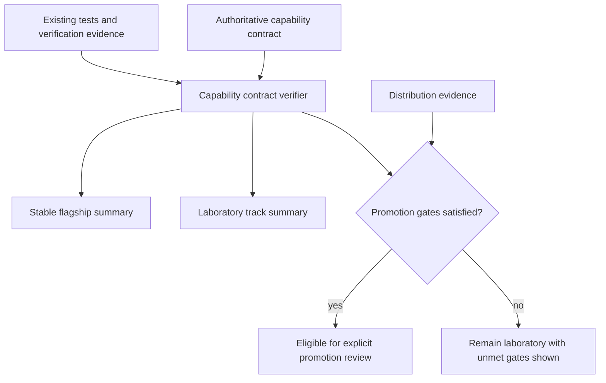
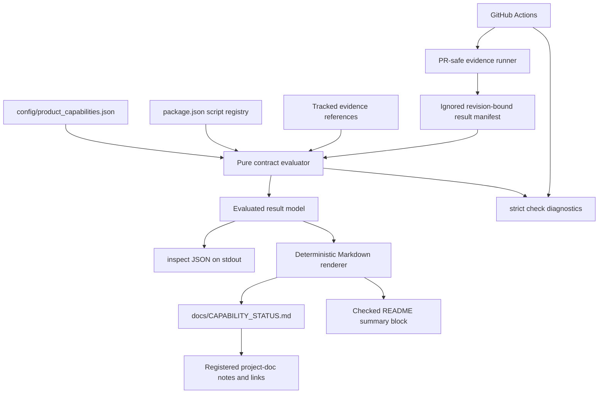
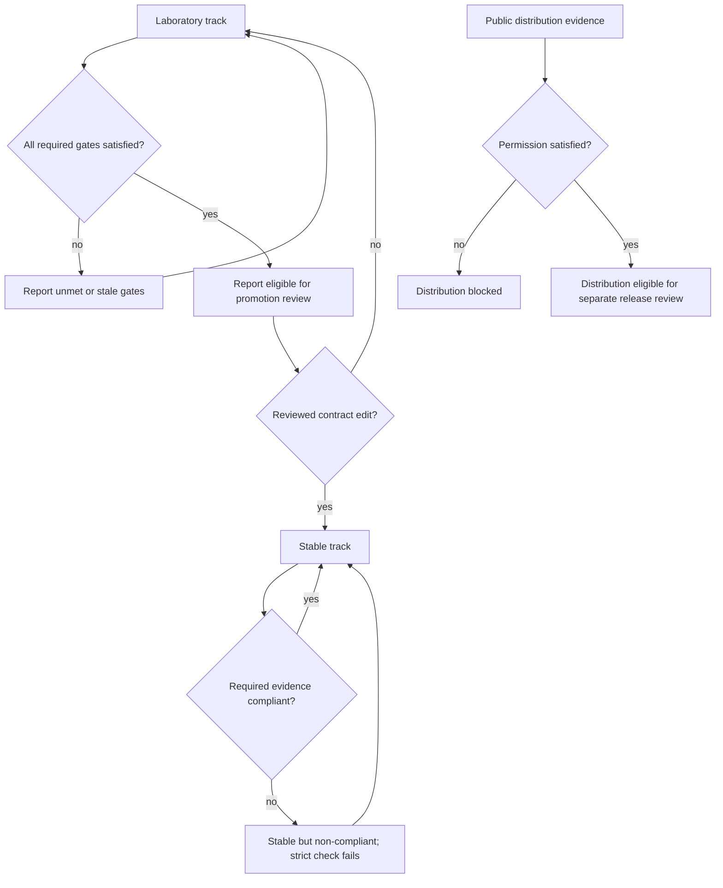
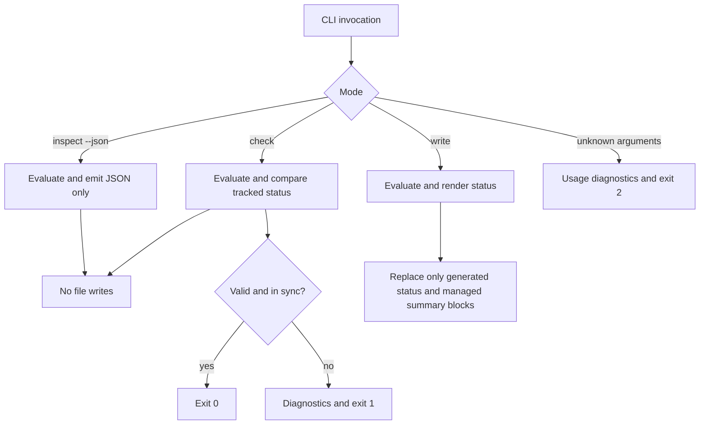

# Flagship Capability Contract - Plan

## Goal Capsule

- **Objective:** Establish one authoritative, machine-verifiable contract for which BOTC Solo Simulator capabilities are stable product commitments and which remain evidence-producing experiments.
- **Product authority:** The contract governs maturity and promotion claims; JS Core remains the runtime authority for rules, AI, permissions, and state, while existing tests and verification artifacts supply evidence.
- **Authority order:** This plan's Product Contract governs product intent; the versioned capability contract governs maintained classifications; JS Core and its tests govern runtime behavior; generated status text never overrides those sources.
- **Execution profile:** Standard, contract-first, test-first implementation on `codex/flagship-capability-contract`, landing through one issue and one pull request against `dev`.
- **Stop conditions:** The contract check, generated-status check, focused tests, `npm test`, and the hosted pull-request workflow pass; no gameplay, role, AI-decision, viewmodel, action-bridge, or Unity-layout behavior changes enter the diff.
- **Tail ownership:** `ce-work` owns implementation, verification evidence, commit, push, pull-request review, and landing; branch-protection or default-branch administration remains outside this plan.
- **Open blockers:** None. Public distribution remains permission-gated and is not implied by flagship status.

---

## Product Contract

### Summary

BOTC Solo Simulator will treat TB × Unity × deterministic AI as its stable flagship path.
BMR/SnV, Electron player UI, and LocalLLM remain available laboratory tracks whose promotion requires current, named evidence.

### Problem Frame

The repository already has strong contract tests, packaging checks, and playable evidence, but maturity claims are scattered across README sections, progress baselines, change requests, handoffs, and verification notes.
That fragmentation lets a buildable or previously tested capability appear equivalent to a current product commitment.
The problem is visible today: the default branch trails `dev`, two completed requests still read “in progress,” and the three scripts are advertised together even though their rules fidelity differs.

### Key Decisions

- **One enforceable authority over another status document.** Human-readable summaries may be derived from the capability contract, but they must not independently redefine maturity.
- **Logical separation before physical separation.** Laboratory tracks stay in the repository and remain usable; this work does not split packages, workspaces, or repositories.
- **Promotion requires evidence, not intent.** A capability moves toward flagship only when its declared rules, player-journey, automated-verification, and distribution gates are satisfied with current evidence.
- **Engineering maturity and distribution permission are orthogonal.** A capability may be technically stable while remaining private-use-only or otherwise blocked from public distribution.

### Actors

- A1. **Maintainer or reviewer** needs one place to determine what the project promises and why a capability has its current maturity.
- A2. **Player or evaluator** needs the default path and project-facing documentation to distinguish stable gameplay from opt-in experiments.
- A3. **Automated verifier** needs deterministic rules for detecting contradictory claims, missing evidence, and invalid promotion attempts.

### Requirements

**Capability classification**

- R1. The project has one authoritative capability contract that classifies product tracks and their maturity without requiring readers to reconcile multiple status documents.
- R2. The initial stable flagship is TB gameplay through Unity with deterministic AI and no LocalLLM dependency.
- R3. BMR, SnV, the Electron player experience, and LocalLLM begin as laboratory tracks without losing their existing developer entry points.
- R4. Human-readable status surfaces identify stable and laboratory tracks from the authoritative contract rather than maintaining independent classifications.

**Evidence and promotion**

- R5. Every classified track names the evidence categories required for its current maturity and for its next promotion decision.
- R6. Promotion eligibility requires current evidence for rules fidelity, a player-completable journey, automated contracts, and the intended distribution class.
- R7. Missing, stale, or failing evidence keeps a track at its existing maturity and makes the unmet gate visible to maintainers.
- R8. Passing a subset of checks cannot silently promote a laboratory track or make it part of the default player promise.

**Product and contributor behavior**

- R9. Default setup, run, verification, and packaging guidance leads with the stable flagship while preserving clearly labeled experimental paths.
- R10. Pull-request validation detects contradictions between the authoritative contract and maintained project-facing maturity claims.
- R11. The initial adoption reconciles known stale “in progress” claims whose completion is already supported by repository evidence.
- R12. Flagship maturity never implies public distribution permission; release eligibility remains a separately evidenced gate.

### Key Flows

- F1. **Inspect current product commitment**
  - **Trigger:** A maintainer, reviewer, or evaluator asks what is currently stable.
  - **Actors:** A1, A2, A3.
  - **Steps:** The status surface reads the authoritative classification, shows each track, and names satisfied or unmet evidence gates.
  - **Outcome:** Stable and experimental claims can be understood without reading historical handoffs or progress logs.
  - **Covered by:** R1-R5, R7.

- F2. **Validate an ordinary pull request**
  - **Trigger:** A contribution changes a classified capability, its evidence, or a maturity claim.
  - **Actors:** A1, A3.
  - **Steps:** Automated validation checks the contract, maintained summaries, and applicable evidence references for consistency.
  - **Outcome:** Contradictory or unsupported maturity claims fail before merge.
  - **Covered by:** R4, R5, R8, R10.

- F3. **Evaluate promotion from laboratory**
  - **Trigger:** A maintainer proposes that an experimental track become part of the flagship promise.
  - **Actors:** A1, A3.
  - **Steps:** The track is evaluated against every declared promotion gate, and unmet gates remain visible rather than being waived implicitly.
  - **Outcome:** Passing evidence makes the track eligible for explicit review; it does not auto-promote.
  - **Covered by:** R5-R8.

- F4. **Evaluate a package or release claim**
  - **Trigger:** A build is described as distributable outside the private development context.
  - **Actors:** A1, A3.
  - **Steps:** Engineering maturity and distribution evidence are evaluated separately.
  - **Outcome:** A technically stable build can remain blocked from public distribution without blocking private flagship development.
  - **Covered by:** R6, R12.

### Acceptance Examples

- AE1. **Covers R2, R4, R9.** Given a new contributor follows the default project guidance, when they choose the recommended playable path, then they are directed to TB in Unity with deterministic AI and do not need LocalLLM.
- AE2. **Covers R3, R5, R7, R8.** Given BMR contracts pass but its role-fidelity evidence remains incomplete, when status is evaluated, then BMR stays laboratory and the missing fidelity gate is shown.
- AE3. **Covers R3, R9.** Given a developer wants to inspect Electron or LocalLLM, when they follow the experimental guidance, then the existing capability remains usable without being represented as part of the stable default.
- AE4. **Covers R4, R10.** Given a project-facing document calls an experimental track stable without changing its authoritative classification, when pull-request validation runs, then the contradiction is rejected.
- AE5. **Covers R6, R12.** Given the flagship passes its engineering gates but distribution permission is unresolved, when a public-release claim is evaluated, then public distribution remains blocked while private development and verification continue.
- AE6. **Covers R11.** Given later verification proves the bottom-dialogue and LLM-renderer requests completed, when the initial contract is adopted, then those requests no longer remain presented as active unfinished work.

### Success Criteria

- A reviewer can identify the stable flagship, every laboratory track, and each unmet promotion gate from one generated status surface.
- Maintained maturity claims cannot contradict the authoritative contract without a failing repository check.
- The stable default remains runnable and testable without LocalLLM or a BMR/SnV fidelity claim.
- Existing laboratory entry points remain available after adoption.
- The change introduces no gameplay, role-rule, AI-decision, or Unity-layout behavior change.

### Scope Boundaries

**Deferred for later**

- Per-role Exact / Playable Approximation / Partial / Missing matrices and the rule work needed to promote BMR or SnV.
- Fixture-free full-game player certification and broader Unity UX convergence.
- Whole-game AI league evaluation and causal-event pipeline work.
- Integration of the current `dev` history into the remote default branch.

**Outside this product's identity**

- Deleting BMR/SnV, Electron, LocalLLM, or the data/ML laboratory merely to simplify the status model.
- Treating one passing test, one successful package, or one historical screenshot set as automatic product promotion.
- Treating an engineering maturity label as legal advice or authorization to distribute BOTC intellectual property.
- Physically splitting the repository before logical promotion gates prove insufficient.

### Dependencies / Assumptions

- Existing focused npm, Unity, package, and verification commands remain the initial evidence sources.
- JS Core remains the runtime source of truth; the capability contract governs project claims rather than gameplay state.
- Historical verification notes remain useful evidence but may need freshness rules before supporting promotion.
- Public distribution continues to require separate policy or permission evidence.

### Outstanding Questions

The Planning Contract resolves the former technical questions: a versioned JSON authority, one Node evaluator with explicit freshness policies, a fully generated status page, and a deterministic pull-request check.
No launch-blocking question remains.

### Sources / Research

- `AGENTS.md` — authority boundaries, validation expectations, and generated-file rules.
- `README.md` — current product claims, three-script maturity, run/package guidance, and rights caveats.
- `package.json` — existing focused test, package, and verification command surface.
- `docs/PROGRESS_BASELINE_2026-06-01.md` — Unity-primary framing, AI limits, and the missing role-fidelity matrix.
- `docs/requirements/CHANGE_REQUESTS.md` — known stale “in progress” entries.
- `docs/verification/UNITY_BOTTOM_DIALOGUE_QUEUE_2026-05-15.md` and `docs/verification/AI_LLM_RENDERER_QUALITY_2026-05-15.md` — completion evidence for those entries.
- `docs/design/LOCAL_LLM_LANGUAGE_RENDERER_TRIAL.md` — deterministic-default and LocalLLM-experimental boundary.
- `docs/design/CURRENT_THREAD_HANDOFF.md` — historical worktree warning that is no longer current guidance.
- TPI Community Created Content Policy: https://bloodontheclocktower.com/pages/community-created-content-policy

---

## Planning Contract

### Product Contract Preservation

This implementation preserves the Product Contract's classification, promotion, distribution, scope, requirements, flows, and acceptance examples; planning only resolves its deferred technical choices.

### Key Technical Decisions

| ID | Decision | Rationale |
|---|---|---|
| KTD1 | `config/product_capabilities.json` is the sole maintained classification authority and carries `schemaVersion: 1`. | Project metadata does not belong in runtime `assets/`, and a versioned JSON file is directly reviewable by humans, Node, and CI. |
| KTD2 | `engineeringMaturity`, evaluated compliance, promotion eligibility, and distribution permission remain separate fields. | The evaluator must expose stale evidence or eligibility without silently changing a reviewed maturity label or implying public-release permission. |
| KTD3 | `scripts/product_capability_contract.mjs` builds one pure evaluated result that feeds JSON inspection, Markdown rendering, and strict checks; a separate CI runner supplies executed outcomes. | Separate status evaluators would recreate drift, while keeping process execution outside the evaluator preserves deterministic read-only inspection. |
| KTD4 | Evidence freshness uses only `ci-run`, `expires`, or `evergreen`; `ci-run` requires a supplied execution result, `expires` accepts an injected `--as-of` date, and no policy reads filesystem modification time. | Script existence is not proof that it passed, and explicit policies make missing, failed, unverified, and stale states reproducible. |
| KTD5 | `docs/CAPABILITY_STATUS.md` is a deterministic generated file, README contains a generated and checked capability-summary block, and other maintained entry documents use registered checked notes or links instead of free-standing classifications. | The flagship must be visible at the main entry point without creating prose that can drift outside the authority. |
| KTD6 | The CLI exposes read-only `inspect --json`, strict non-writing `check`, and explicit `write` modes with exit codes 0 for a valid result, 1 for invalidity or drift, and 2 for invocation errors; current-evidence verification is a separate repository command. | Laboratory gaps are valid product state, while malformed contracts, unsupported stable claims, generated-file drift, and absent execution evidence must remain distinguishable. |
| KTD7 | `npm test` includes the focused contract test, and `.github/workflows/ci.yml` runs `capabilities:verify` on Windows with Node 22 for pull requests targeting `dev` or `main`. | The verification command runs the declared PR-safe evidence first and then checks its revision-bound results, without pulling Unity builds or live LocalLLM work into every PR. |
| KTD8 | Public distribution stays `blocked` unless separately declared evidence supports the intended distribution class; the tool never publishes, releases, promotes, or waives a gate. | Engineering checks cannot grant rights or authorize an external state change. |

### Assumptions

These implementation choices were not separately confirmed because scoping confirmation was disabled for this autonomous run; `ce-work` may narrow them when repository evidence contradicts them, but must not broaden product scope.

- The initial contract contains five tracks: `tb-unity-deterministic`, `bmr`, `snv`, `electron-player-ui`, and `local-llm-renderer`.
- Each track evaluates the same four promotion categories: rules fidelity, player-completable journey, automated contracts, and intended distribution class.
- A `ci-run` evidence reference names an existing PR-safe npm script; `scripts/run_product_capability_ci.mjs` executes each distinct command once and supplies an ignored result manifest containing the revision identity, contract hash, command, outcome, and diagnostics summary.
- The evaluator never launches evidence commands; without a matching supplied result, `ci-run` evaluates as `unverified`, and a non-zero supplied outcome evaluates as `failed`.
- An `expires` record stores its observed date and validity window in the contract; an `evergreen` record may support a structural fact but cannot be the sole proof for a time-sensitive satisfied promotion gate.
- README can lead with a generated capability-summary block and retain laboratory commands as labeled opt-in paths without removing existing entry points.
- The new workflow targets `dev` and `main`, but repository administration is unchanged; until branch protection requires the check, the project may claim that validation runs, not that GitHub prevents an unvalidated merge.
- The implementation and pull request target `dev` because the remote default branch is behind the active development history.

### High-Level Technical Design

The following diagrams are directional design constraints rather than implementation code.
The contract is evaluated once into a stable result model containing schema version, contract hash, tracks, gate states, promotion eligibility, distribution state, and evidence provenance.
All output adapters consume that result; only the explicit `write` adapter mutates a tracked file.

Promotion is a reviewed classification change, not an evaluator side effect.
A stable track whose evidence becomes stale remains labeled stable but becomes non-compliant until evidence is restored.

Each command mode shares validation and evaluation but has a distinct mutation and output contract.

The repository-level `capabilities:verify` command runs the declared PR-safe evidence commands, creates an ignored result manifest, and invokes strict checking with a required matching revision.
The generated page presents information in this order: recommended stable flagship and entry command; laboratory summary; per-track gate meanings and next actions; distribution-permission status; evidence provenance.

### Evidence Semantics

| State | Meaning | Strict-check behavior |
|---|---|---|
| `satisfied` | The declared evidence exists and meets its explicit freshness policy. | Passes for the gate. |
| `unmet` | A laboratory track intentionally lacks the evidence required for promotion. | Reported with exit 0 unless the contract claims the track is stable. |
| `unverified` | A `ci-run` command exists but no matching result was supplied for the evaluated revision and contract hash. | Visible during inspection; fails current-evidence verification for a stable claim. |
| `failed` | A matching supplied execution result records a non-zero outcome. | Fails current-evidence verification for a stable claim and retains bounded diagnostics. |
| `stale` | Expiring evidence exists but is outside its declared validity window. | Fails for a stable claim; remains visible but valid for a laboratory track. |
| `missing` | A referenced path or npm script does not exist. | Fails because the contract is not grounded. |
| `blocked` | A separate prerequisite, including distribution permission, is not satisfied. | Fails only when the contract makes a claim that requires it. |
| `invalid` | Schema, identifier, relationship, or classification semantics are contradictory. | Fails validation. |

### Sequencing

1. Establish the versioned contract, structural validator, and initial red/green fixtures.
2. Add evidence evaluation, eligibility computation, stable exit semantics, and read-only JSON inspection.
3. Generate the human status page and managed README summary, then remove parallel maturity classifications from maintained entry documents.
4. Wire focused checks and the revision-bound evidence runner into npm and GitHub Actions without adding heavyweight Unity or live-model jobs.
5. Run repository regression gates, record verification, and confirm the diff contains no gameplay behavior changes.

### System-Wide Impact

| Area | Impact | Boundary |
|---|---|---|
| Runtime rules and state | None. | The contract is project metadata and is never imported by JS Core gameplay paths. |
| Contributor workflow | Adds inspect, write, check, current-evidence verification, and focused test commands. | Only `write` may update tracked generated status surfaces; the evidence runner writes only ignored results. |
| Documentation | Replaces scattered maintained maturity claims with one generated status page, a managed README summary, and checked notes or pointers. | Historical notes remain historical and do not become classification inputs. |
| CI | Adds the repository's first checked-in GitHub Actions workflow. | No branch-protection or default-branch setting is changed. |
| Evidence lifecycle | Makes provenance, execution outcome, revision binding, and freshness explicit. | The evaluator never launches commands; the CI runner executes only declared PR-safe evidence and never runs Unity builds or live-model work. |
| Distribution posture | Exposes a status independent of engineering maturity. | No legal conclusion, release, upload, or publication is automated. |

### Risks and Dependencies

| Risk or dependency | Mitigation |
|---|---|
| Broad tests are mistaken for BMR/SnV rules fidelity or mock LLM quality. | Map each evidence reference to a narrow claim and leave unsupported promotion gates unmet. |
| A clock-dependent status becomes flaky. | Use explicit freshness metadata, UTC date semantics, and injected `--as-of` fixtures; never inspect mtime. |
| Generated prose and JSON disagree. | Render both from one evaluated object and compare the tracked Markdown byte-for-byte in `check`. |
| A script's existence is mistaken for a passing result. | Require a revision- and contract-hash-bound result for `ci-run`; report absent results as `unverified` and non-zero outcomes as `failed`. |
| Maintained entry prose contradicts a generated classification while retaining its link. | Manage the README summary, register other status notes, and reject canonical track-and-maturity claims outside checked surfaces. |
| A stable track loses evidence and is silently demoted. | Keep maturity explicit, report non-compliance, and fail strict validation without rewriting the contract. |
| GitHub workflow success is described as an enforced merge gate. | Document the missing branch-protection configuration as a governance limitation. |
| The first workflow selects a different runtime from local development. | Pin Node 22 in CI and keep implementation within standard ESM APIs already used by the repository. |
| Heavy Unity, LocalLLM, or packaging work makes ordinary PRs unreliable. | Keep those as referenced or expiring evidence and run only deterministic repository tests continuously. |
| Existing `main` and `dev` histories are divergent. | Land this scoped change against `dev`; default-branch integration remains deferred. |

### Planning Research

- `scripts/sync_unity_assets.mjs` and `scripts/sync_unity_build_core.mjs` establish the canonical-source plus explicit `--check` pattern.
- `tests/*_contracts.mjs` establish direct `node:assert/strict` contract tests with deterministic fixtures and non-zero assertion failures.
- `package.json` supplies the existing command registry and shows that `npm test` is the repository regression baseline.
- The remote repository has no `.github/` workflow and does not protect `dev`; the workflow is an executable check, not proof of merge enforcement.
- No `CONCEPTS.md` or `docs/solutions/` corpus exists, so this plan records its load-bearing decisions instead of citing an undocumented precedent.

---

## Implementation Units

### U1. Establish the versioned authority and structural contract

- **Goal:** Add the canonical product-capability file, structural validation, and initial classifications without importing it into runtime gameplay.
- **Requirements:** R1-R3, R5, R8, R12; F1, F3, F4; AE2, AE5.
- **Files:** `config/product_capabilities.json`, `scripts/product_capability_contract.mjs`, `tests/product_capability_contracts.mjs`.
- **Approach:** Start with deterministic fixtures for missing fields, duplicate IDs, unknown states, invalid references, and the exact five-track initial classification; implement schema-version and semantic checks with standard Node APIs.
- **Execution note:** Make each structural fixture fail for the intended reason before implementing the smallest validator behavior that turns it green.
- **Patterns:** Follow `tests/*_contracts.mjs` for assertions and `scripts/sync_unity_assets.mjs` for collected repo-relative diagnostics.
- **Test scenarios:** The initial contract declares one stable default and four laboratory tracks; duplicate track or gate IDs fail; an unsupported schema version fails; changing maturity does not happen as a validator side effect; engineering and distribution fields remain independent.
- **Verification:** `npm run test:product-capabilities` passes the U1 structural cases after U4 registers the command; before U4, `node tests/product_capability_contracts.mjs` runs directly.
- **Dependencies:** None.

### U2. Evaluate evidence, compliance, and promotion eligibility

- **Goal:** Produce one deterministic evaluated result and expose stable read-only inspection and strict-validation behavior.
- **Requirements:** R5-R8, R10, R12; F1-F4; AE2, AE4, AE5.
- **Files:** `scripts/product_capability_contract.mjs`, `tests/product_capability_contracts.mjs`, `config/product_capabilities.json`.
- **Approach:** Implement `ci-run`, `expires`, and `evergreen` policies, revision-bound result ingestion, contract hashing, evidence provenance, compliance, and eligibility in a pure function; keep CLI parsing and output adapters thin.
- **Execution note:** Extend the fixture matrix one state or exit path at a time, then keep the evaluator pure while adapters consume its result.
- **Test scenarios:** Laboratory unmet gates return a valid inspection; unverified, failed, stale, and missing evidence have distinct states; wrong-revision and wrong-contract-hash results are rejected; injected dates cross an expiry boundary deterministically; incomplete stable claims fail current-evidence verification without demotion; all gates produce eligibility but never promotion; public distribution can remain blocked while engineering maturity is satisfied; JSON stdout is parseable and diagnostics use stderr.
- **Verification:** `node tests/product_capability_contracts.mjs` passes the evaluator, fixture, output-channel, exit-code, and no-write cases.
- **Dependencies:** U1.

### U3. Generate the human status and reconcile maintained claims

- **Goal:** Give maintainers and players one generated status page while preserving clearly labeled laboratory entry points and historical records.
- **Requirements:** R4, R7, R9-R12; F1, F2, F4; AE1, AE3-AE6.
- **Files:** `docs/CAPABILITY_STATUS.md`, `README.md`, `unity-prototype/README.md`, `docs/INDEX.md`, `docs/PROJECT_STATUS_AND_OPEN_REQUIREMENTS.md`, `docs/packaging/WINDOWS_EXE.md`, `docs/packaging/AI_POLISHED_UNITY_RELEASE.md`, `docs/requirements/CHANGE_REQUESTS.md`, `scripts/product_capability_contract.mjs`, `tests/product_capability_contracts.mjs`.
- **Approach:** Render the full status and managed README summary from the evaluated result without volatile timestamps; order the full page as flagship entry, laboratory summary, gate details with meanings and next actions, separate distribution status, then provenance; register checked notes or links in Unity, Electron, AI packaging, index, and legacy status documents; move BMR, SnV, Electron, and LocalLLM guidance under laboratory labels; close the two stale change requests with their existing verification references.
- **Test scenarios:** Generated status, README summary, and JSON list identical classifications; `check` catches one-line drift in a generated surface; canonical track-and-maturity claims outside registered surfaces fail; default guidance requires no LocalLLM; all laboratory entry points and packaging paths remain documented and labeled; the status hierarchy keeps distribution separate; the two May 15 requests are completed with evidence.
- **Verification:** Run the explicit write command once, then run the strict check twice and confirm the second run produces no file change; run the focused contract suite.
- **Dependencies:** U2.

### U4. Expose repository commands and continuous validation

- **Goal:** Make contract inspection, regeneration, drift checking, and regression testing available through the established npm and pull-request surfaces.
- **Requirements:** R4, R8-R10; F2; AE4.
- **Files:** `package.json`, `.github/workflows/ci.yml`, `scripts/run_product_capability_ci.mjs`, `tests/product_capability_contracts.mjs`.
- **Approach:** Add `capabilities:inspect`, `capabilities:write`, `capabilities:check`, `capabilities:verify`, and `test:product-capabilities`; include the focused test in `npm test`; make the evidence runner execute each declared PR-safe command once, write an ignored bounded result manifest, and invoke current-evidence checking; add a Windows Node 22 workflow for pull requests and pushes on `dev` and `main` that runs `npm ci` and `capabilities:verify`.
- **Test scenarios:** Every declared `ci-run` script exists and is PR-safe; the runner records pass and failure without recursion; a result for the wrong revision or contract hash cannot satisfy a gate; `npm test` reaches the focused contract; the workflow names both branches; inspect and static check do not mutate the repository; only write changes managed status surfaces; invalid invocation exits 2.
- **Verification:** `npm run capabilities:check`, `npm run test:product-capabilities`, `npm test`, and `npm run capabilities:verify` pass locally; the pull-request workflow completes successfully after push.
- **Dependencies:** U3.

### U5. Record final evidence and audit the behavior boundary

- **Goal:** Leave reproducible verification evidence and prove this governance change did not alter the playable engine or generated runtime mirrors.
- **Requirements:** R2, R3, R9-R12; AE1, AE3, AE5, AE6.
- **Files:** `docs/verification/FLAGSHIP_CAPABILITY_CONTRACT_2026-07-13.md` and the completed U1-U4 diff.
- **Approach:** Record commands, results, CI limitations, initial classification, and distribution posture; inspect the final path list for forbidden gameplay/viewmodel/bridge/UI changes and remove any abandoned experiment or generated build output.
- **Test scenarios:** A clean checkout can inspect and check the contract; all focused and full regressions pass; no gameplay authority file changed; no build, model, output, or package artifact is committed; branch protection is not overstated.
- **Verification:** Run the complete Verification Contract, inspect the final diff against `origin/dev`, and record only observed results.
- **Dependencies:** U1-U4.

---

## Verification Contract

| Gate | Command or evidence | Proves | Units |
|---|---|---|---|
| Focused capability contracts | `npm run test:product-capabilities` | Schema, initial classifications, execution-result binding, freshness policies, eligibility, distribution separation, renderer parity, exit semantics, and mutation boundaries. | U1-U4 |
| Strict authority and drift check | `npm run capabilities:check` | The live contract is valid, references resolve, registered status surfaces contain no drift or unowned maturity claims, and laboratory gaps remain visible. | U2-U4 |
| Read-only machine inspection | `npm run capabilities:inspect -- --json` | A machine consumer receives parseable JSON, including `unverified` when current CI results are absent, without an external write or automatic promotion. | U2 |
| Current evidence verification | `npm run capabilities:verify` | Declared PR-safe evidence commands pass and their revision- and contract-bound results satisfy the stable track before strict checking. | U2, U4-U5 |
| Repository regression baseline | `npm test` | Existing JS, Electron, AI, Unity bridge/viewmodel, asset, demo, and text contracts remain green with the focused capability contract included. | U1-U5 |
| Patch hygiene | Repository patch whitespace diagnostics | No whitespace errors or malformed patch lines. | U1-U5 |
| Gameplay-boundary audit | Final changed-path review against `origin/dev` | No gameplay, AI-decision, bridge/viewmodel, or Unity UI implementation file changed. | U5 |
| Hosted validation | GitHub Actions run for the pull request against `dev` | The checked-in Node 22 workflow can install and execute the repository regression baseline remotely. | U4-U5 |
| Verification record | `docs/verification/FLAGSHIP_CAPABILITY_CONTRACT_2026-07-13.md` | Observed commands, results, skipped heavy checks, and the non-enforced branch-protection limitation are durable. | U5 |

Behavioral acceptance requires all six Product Contract acceptance examples to be represented by deterministic assertions or document-contract checks.
No Unity batchmode, screenshot, LocalLLM live call, package build, or public-release action is required because this plan changes no corresponding runtime behavior and those checks are not safe continuous gates.

---

## Definition of Done

### Global Completion

- `config/product_capabilities.json` is the only maintained source that classifies TB × Unity × deterministic AI as stable and BMR, SnV, Electron player UI, and LocalLLM as laboratory.
- Inspection, strict checking, rendering, and current-evidence verification use one evaluated result and honor the documented state and exit semantics.
- A `ci-run` gate is satisfied only by a matching executed result; absent and failing results surface as `unverified` and `failed` rather than inheriting truth from script existence.
- Human status and the README summary are generated, maintained entry documents use registered checked notes or links, and unowned contradictory maturity prose fails a repository check.
- Promotion eligibility never mutates maturity, and engineering stability never grants public distribution permission.
- Default and packaging documentation lead to the deterministic Unity TB path while every BMR, SnV, Electron, and LocalLLM entry point remains available and labeled as laboratory.
- The two stale May 15 change requests are reconciled with their existing verification evidence.
- All Verification Contract gates that apply locally pass, the hosted workflow is green, and any external enforcement limitation is recorded honestly.
- The final diff contains no gameplay authority, bridge/viewmodel contract, Unity UI, generated build, model, dataset, or release artifact change.
- Abandoned attempts, temporary fixtures outside tests, and scratch output are removed before commit.

### Unit Completion

| Unit | Done signal |
|---|---|
| U1 | The versioned authority and structural failures are covered by deterministic tests. |
| U2 | Evidence states, revision-bound results, eligibility, JSON inspection, strict validation, and exit semantics pass focused tests without writes or automatic state changes. |
| U3 | The generated status and README block are byte-stable, entry and packaging documentation cannot maintain competing maturity claims, and stale change requests are closed with evidence. |
| U4 | npm commands and the Node 22 GitHub Actions workflow execute PR-safe evidence, bind results to the evaluated revision, and run the repository regression baseline without recursion. |
| U5 | The final verification note records observed evidence, the behavior-boundary audit is empty, and the change is ready to land against `dev`. |
