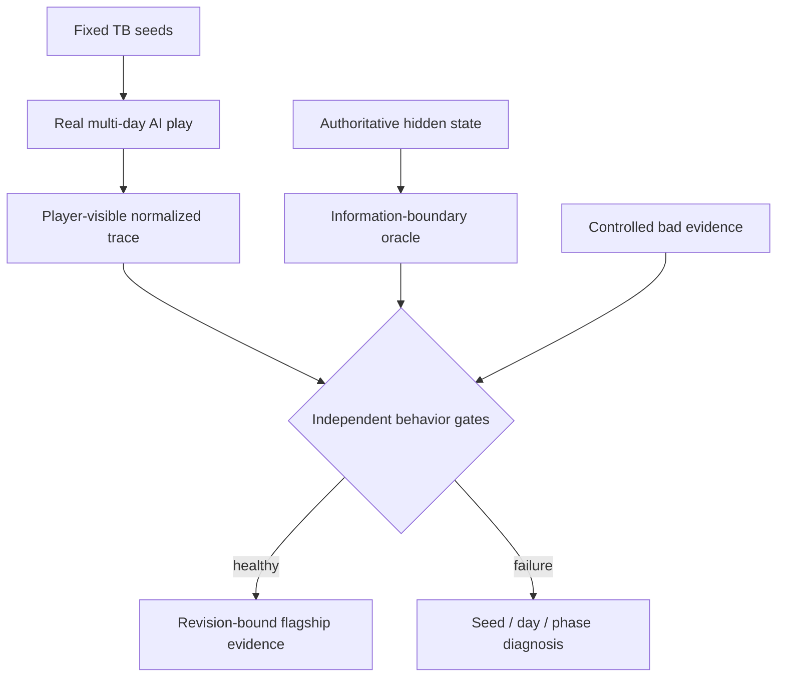
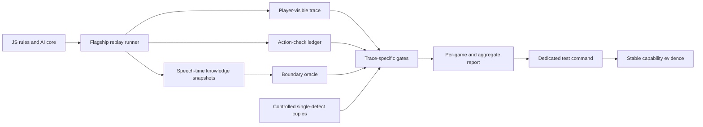
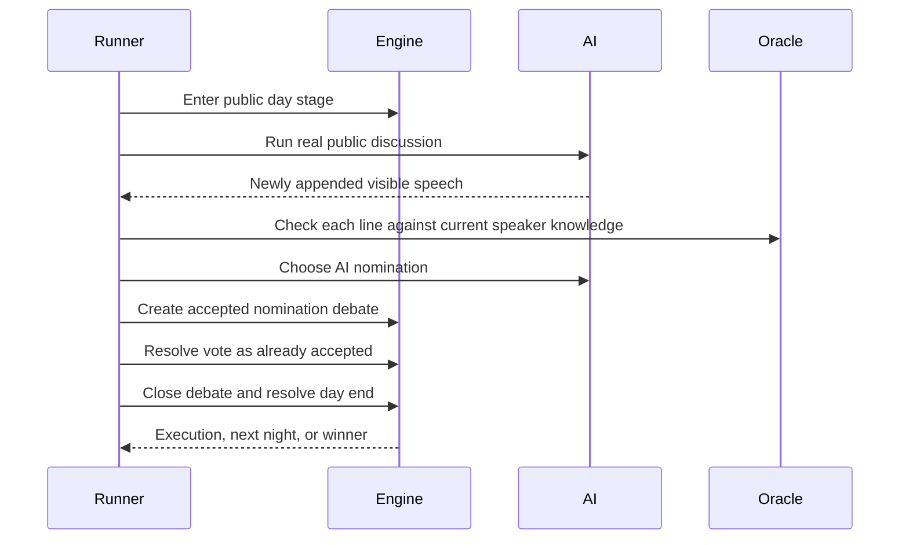
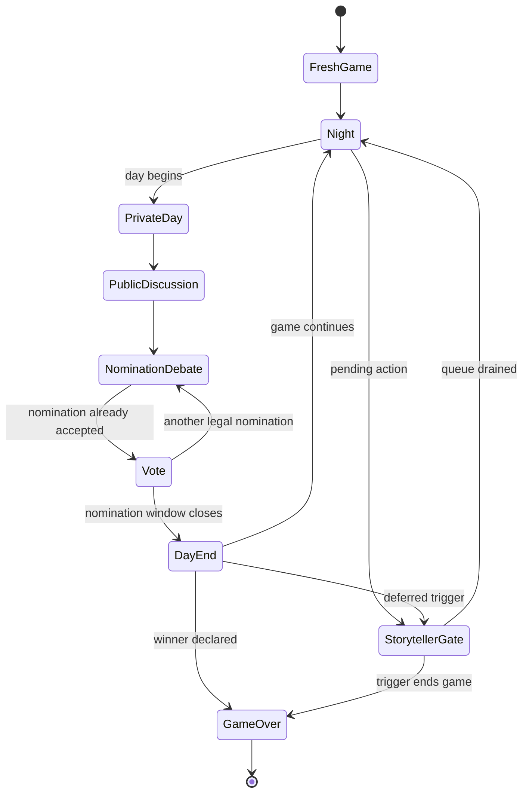
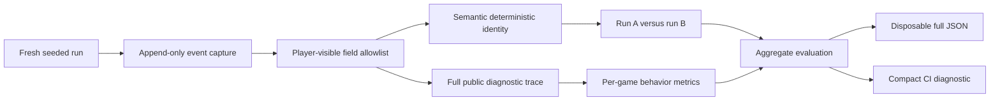
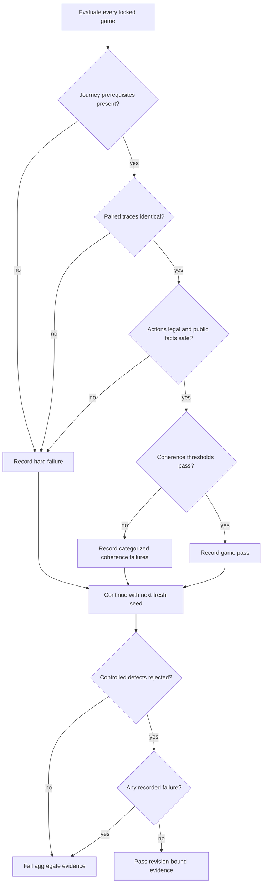

# Causal Flagship Replay Lab - Plan

## Goal Capsule

- **Objective:** Make deterministic AI a verifiable flagship promise by running a small fixed-seed Trouble Brewing corpus through real multi-day discussion, nomination, voting, and endgame behavior.
- **Product authority:** The JS core remains authoritative for rules, AI decisions, permissions, and information boundaries; the capability contract remains authoritative for the stable-track claim.
- **Trust condition:** A healthy corpus must pass behavior-level gates, and controlled bad evidence must prove that every gate can reject the defect it claims to detect.
- **Open blockers:** None before planning. Exact seeds and coherence thresholds must be selected from a fresh deterministic baseline and locked before any behavior correction.

---

## Product Contract

### Summary

Add a bounded Trouble Brewing replay evaluation that plays real deterministic AI games to a winner and judges stable behavior invariants instead of exact transcripts.
Publish the result as revision-bound evidence for the stable flagship track.

### Problem Frame

The stable default track is named “Unity + Trouble Brewing + deterministic AI,” but its promotion evidence currently covers role contracts, the Unity demo journey, and Unity viewmodel contracts rather than game-level AI quality.

The repository has two strong but disconnected evidence surfaces.
The full-game contracts prove seeded rules progression, nominations, votes, and endgame completion without running public AI discussion throughout the game.
The AI quality evaluator proves many isolated dialogue and rationale properties without showing that those properties survive one real multi-day game.

A fresh deterministic dialogue smoke sampled 22 lines with 15 warnings, including dense sentences and scripted future-action phrasing.
Those warnings should guide later dialogue work, but the immediate gap is the absence of a trustworthy whole-game measurement surface.

### Key Decisions

- **Behavior invariants over golden transcripts.** The flagship gate checks stable outcomes and relationships so harmless wording changes do not invalidate the corpus.
- **Player-visible judging with a narrow boundary oracle.** Social-quality metrics use the public/player-visible trace; authoritative hidden state may be consulted only to determine whether a speaker used information they could not legally know.
- **Independent gates over an opaque score.** Completion, determinism, legality, information safety, repetition, continuity, and decision coherence fail and diagnose separately.
- **Gate sensitivity is part of the product promise.** Passing healthy samples is insufficient unless controlled bad samples fail the intended categories.
- **Fix real hard defects instead of weakening evidence.** If the locked corpus exposes a hard failure, the iteration includes the smallest JS behavior correction needed to preserve the promise.

### Actors

- A1. **Maintainer / reviewer:** Needs a fast, reproducible answer to whether a revision preserves flagship AI behavior and where a failure began.
- A2. **Deterministic AI table:** Produces public discussion, nominations, defenses, votes, and cross-day behavior from the JS core.
- A3. **Capability verifier:** Runs declared evidence, binds it to a revision, and blocks a stable claim when the replay gate fails.

### Requirements

**Corpus and journey**

- R1. The flagship corpus covers only the stable Trouble Brewing deterministic-AI track.
- R2. The corpus contains at least three fixed-seed games, each reaching a declared winner within a bounded number of days.
- R3. Every game runs real public AI discussion and resolves at least one AI nomination and vote unless an earlier rules-defined win makes that impossible.
- R4. The corpus includes a multi-day path whose AI behavior can be evaluated across at least two public discussion days.

**Observation and evidence**

- R5. Each game produces a normalized trace of seed, day, phase, public speech, nominations, votes, executions, and winner without wall-clock fields in the deterministic identity.
- R6. Social-quality gates consume player-visible events rather than generation templates or internal rationale structures.
- R7. Information-boundary validation may inspect authoritative state only to test whether each public speaker had legal access to the disclosed fact.
- R8. Every failure identifies the seed, day, phase, gate category, and nearest relevant public event.
- R9. The report preserves per-game results and an aggregate pass/fail without collapsing the categories into one composite score.

**Flagship gates**

- R10. Hard blockers cover non-completion, nondeterministic normalized output, illegal or rejected AI actions, and public hidden-information leakage.
- R11. Coherence gates cover repeated public reasoning, cross-day stance continuity, nomination justification, and nomination-to-vote alignment.
- R12. Thresholds are explicit, deterministic, and justified by the locked baseline rather than tuned after a failing behavior is observed.
- R13. Each hard-blocker and coherence-gate family has at least one controlled bad example that the evaluator rejects under the expected category.
- R14. Exact transcript equality is never a pass condition.

**Product evidence**

- R15. A dedicated test command runs the replay gate in the normal JavaScript contract suite and exits nonzero on any gate failure.
- R16. The stable capability contract declares that command as fresh CI evidence for deterministic AI quality.
- R17. Capability verification records the replay command result against the same revision as the other stable-track evidence.
- R18. Generated replay and report outputs remain disposable evidence and are not committed as source files.

### Key Flows

- F1. **Healthy flagship verification**
  - **Trigger:** A stable-track verification run starts for a revision.
  - **Actors:** A2, A3.
  - **Steps:** Run every fixed seed through real multi-day AI play, normalize player-visible events, evaluate independent gates, and publish per-game plus aggregate results.
  - **Outcome:** The replay evidence passes and is bound to the verified revision.
  - **Covers:** R1-R12, R15-R18.

- F2. **Actionable behavior failure**
  - **Trigger:** A game fails to complete or violates one behavior gate.
  - **Actors:** A1, A3.
  - **Steps:** Stop the replay command with a failing result while preserving diagnostics for the seed, day, phase, category, and nearest event.
  - **Outcome:** The stable capability claim is blocked and the maintainer receives a reproducible failure location.
  - **Covers:** R8-R12, R15-R17.

- F3. **Gate sensitivity proof**
  - **Trigger:** Contract tests supply a controlled bad trace or summary.
  - **Actors:** A3.
  - **Steps:** Evaluate the corrupted evidence with the same gate logic used for healthy games.
  - **Outcome:** The intended category fails while an unchanged healthy control still passes.
  - **Covers:** R9-R14.

### Acceptance Examples

- AE1. **Covers R2-R5, R10.** Given a locked seed, when the game is run twice, then both runs reach the same winner and emit identical normalized traces.
- AE2. **Covers R3-R4.** Given a normal multi-day seed, when the replay completes, then the trace contains public AI speech on at least two days and a resolved AI nomination and vote.
- AE3. **Covers R6-R7, R10.** Given a public line augmented with a fact the speaker could not know, when the boundary oracle evaluates it, then the hidden-information gate fails without exposing the hidden fact in player-facing diagnostics.
- AE4. **Covers R11-R13.** Given controlled evidence with repeated reasoning or a vote that contradicts the recorded nomination stance, when coherence gates run, then the corresponding category fails.
- AE5. **Covers R10, R13.** Given a controlled game result with no winner at the day limit or a rejected AI action, when hard gates run, then the replay evidence fails even if every dialogue metric passes.
- AE6. **Covers R8-R9, R14.** Given a harmless rewording that preserves observed behavior, when the normalized replay is evaluated, then no golden-text comparison fails the run.
- AE7. **Covers R15-R17.** Given a replay-gate failure, when capability verification runs, then it exits nonzero, records the failed command against the revision, and still runs later declared evidence.

### Success Criteria

- All locked games complete twice with identical normalized traces and declared winners.
- Every controlled bad example fails its intended gate family, with no false pass in the sensitivity contract.
- A failure can be reproduced from the reported seed and located by day, phase, category, and nearest public event.
- The stable capability verifier treats replay quality as revision-bound evidence and fails when that evidence fails.
- The replay command completes within the existing per-command CI timeout.
- The full JavaScript/Electron/Unity contract suite remains green.

### Scope Boundaries

**In scope**

- A small deterministic Trouble Brewing whole-game corpus.
- Player-visible replay normalization, independent behavior gates, sensitivity contracts, and capability evidence.
- The smallest JS behavior correction when a locked seed exposes a hard blocker or an agreed coherence failure.

**Deferred for later**

- Counterfactual twin games and hidden-state metamorphic testing.
- Longitudinal error budgets, trend dashboards, and automatic failure minimization.
- A shared scenario language or migration of the existing AI quality suite.
- Player-facing case graphs, postgame autopsies, semantic screenshots, and portable evidence capsules.

**Outside this iteration**

- Unity UI changes, Electron UI changes, bridge protocol changes, and release packaging.
- BMR, SnV, LocalLLM, Python-model, or cross-script promotion work.
- New roles, new scripts, broad dialogue rewriting, or wholesale AI evaluator refactoring.

### Dependencies / Assumptions

- Existing seeded engine and AI APIs can drive a full Trouble Brewing game without transferring authority out of the JS core.
- Existing public speech, nomination, vote, belief-continuity, and hidden-information utilities provide enough observable evidence for a first bounded gate.
- At least three stable seeds can satisfy the journey coverage without fixture-only state fabrication.
- Generated timestamps and machine paths can be excluded from deterministic comparison without hiding behavior differences.

### Outstanding Questions

**Deferred to planning**

- Which three or more seeds provide the smallest corpus that covers multi-day continuity, nominations, votes, and both ordinary and early terminal paths?
- What baseline thresholds distinguish repeated reasoning, continuity, and nomination-to-vote alignment without matching exact prose?
- Which existing evaluation helpers can be reused without coupling the new gate to private rationale fields?

### Sources / Research

- `config/product_capabilities.json`
- `tests/full_game_loop_contracts.mjs`
- `scripts/ai.js`
- `scripts/ai_quality_eval.mjs`
- `tests/ai_quality_eval_contracts.mjs`
- `scripts/ai_dialogue_smoke.mjs`
- `scripts/unity_action_bridge.mjs`
- `scripts/run_product_capability_ci.mjs`
- `tests/product_capability_ci_runner.mjs`
- `docs/verification/UNITY_CLICK_UX_QA_2026-06-26.md`

---

## Planning Contract

**Product Contract preservation:** Unchanged; the planning sections below implement the existing requirements, flows, acceptance examples, and scope boundaries without redefining them.

### Execution Profile

- **Plan depth:** Standard.
- **Delivery posture:** Test-first characterization followed by the smallest implementation that makes the locked evidence pass.
- **Tail ownership:** `ce-work` owns implementation, verification, GitHub issue/PR handling, CI follow-through, and merge under the user's autonomous-cycle instruction.
- **Stop condition:** Stop and surface a blocker only if implementation requires widening the Product Contract, weakening a locked gate, or changing a bridge/UI/runtime authority boundary.

### Key Technical Decisions

- KTD1. Add a small replay-specific evaluator instead of refactoring `scripts/ai_quality_eval.mjs`; its fixture-oriented private rationale metrics are not a player-visible whole-game contract.
- KTD2. Capture events when they happen and normalize through a field allowlist. The normalized replay envelope has two explicit projections: `publicTrace` retains rendered player-visible speech for diagnostics and social gates, while `deterministicIdentity` retains event order, day/phase/type, public actor/target IDs, deterministic speech semantics, nominations, votes, executions, and winner but excludes rendered wording. Paired-run equality applies only to `deterministicIdentity`; presence and order of speech remain mandatory in `publicTrace`. Never derive either projection from logs or `aiDialogue.timeline` because they contain timestamps, random IDs, truncation, and internal rationale.
- KTD3. Keep two evidence surfaces: a player-visible trace for social gates and a side-channel `actionChecks` ledger for harness legality. Social gates cannot read the ledger or hidden state.
- KTD4. Drive each game through the same JS-core lifecycle as the playable flow, including speech-time boundary checks, accepted nomination debate, vote settlement, Storyteller queue draining, deferred execution, and endgame. Add a backward-compatible optional `onPublicSpeech` observer to `runAIDiscussion`; immediately after each speech event is appended, it receives an immutable player-visible event projection plus the speaker-scoped `buildAgentView` snapshot used to compose that utterance. Omitting the observer preserves every existing caller and return behavior.
- KTD5. Treat nomination debate as an already-accepted nomination. Vote settlement must use the existing already-accepted semantics and close the active debate on both recorded success and recorded failure so day-end cannot deadlock.
- KTD6. Compare two fresh runs per seed using only the enumerated `deterministicIdentity` fields. Its speech entries contain deterministic semantic labels such as speech kind, public focus, parsed stance, and referenced public-evidence category, never rendered text or a text hash. A difference is a defect to diagnose, not noise to strip after observation; harmless rewording that preserves those semantics cannot fail determinism.
- KTD7. Evaluate independent hard and coherence categories, preserve all failures across the corpus, and exit nonzero only after the full report is assembled. A game that cannot initialize records a command-level harness-fatal result while later fresh seeds still run when possible. Its safe diagnostic sentinel is `{ day: 0, phase: "initialization", nearestPublicEvent: { type: "none", reason: "before-first-public-event" } }`; it is infrastructure evidence rather than a replay-category failure, but follows the same aggregate-report and secret-sanitization rules.
- KTD8. Select seeds for journey coverage before examining coherence scores, then lock seeds, raw baseline metrics, threshold formulas, and rationale before any behavior correction. A later failure cannot be resolved by replacing a seed or relaxing a threshold.
- KTD9. Prove sensitivity by cloning healthy evidence and applying one defect at a time. The production evaluator must reject the mutated evidence in the intended category while the healthy control remains green.
- KTD10. Add replay evidence to the stable track's existing `automated-contracts` gate and PR-safe command allowlist; do not add a fifth capability category or change the workflow trigger. Name it fixed-seed replay-invariant evidence and keep its claim boundary in generated capability text: it certifies completion, deterministic identity, legality, declared bounded information safety, and the named coherence relationships only, not general prose quality or unseen-seed generalization.
- KTD11. If the locked corpus exposes a real hard or agreed coherence defect, add a focused failing contract at the owning JS boundary, make the smallest correction, and synchronize the Unity StreamingAssets mirror when runtime JS changes.

### Assumptions

These bets were not separately confirmed because scoping confirmation was disabled for the autonomous cycle.

- The locked main corpus uses nine-player Trouble Brewing games with a fixed human role and deterministic human vote policy; human behavior is excluded from AI coherence denominators.
- Existing seed `260609` is only an initial journey-coverage candidate. Before any characterization run, U1 locks an ordered candidate list of at most five seeds, `MAX_DAYS = 16`, and a final budget of exactly three main-corpus seeds. The first three candidates satisfying journey-only coverage become the corpus; if the budget cannot satisfy coverage or the 120-second command limit, implementation reports a blocker rather than adding seeds or extending the day bound.
- The bounded information oracle uses a finite v1 fact model. Opaque fact IDs cover: `demon-bluff:<roleId>` when an explicit bluff-disclosure marker is paired with a role label; `evil-recognition:<playerId>` when an explicit demon/minion/ally-recognition marker is paired with a player; `actual-role:<playerId>:<roleId>` and `actual-team:<playerId>:<team>` only when an unambiguous actual/true-role or actual/true-team assertion names both subject and value; and `forbidden-marker:<tokenId>` for a fixed player-visible backend/private-token list. Authorization comes only from the utterance-time snapshot's self role/team, known demon/minion/ally/bluff IDs, and already-public role reveals represented by the current agent knowledge model.
- Plain role mentions, accusations, hypotheses, legal bluffs, and repetitions of public claims are not actual-fact assertions in v1. Indirect inference and arbitrary semantic paraphrase detection are intentionally unsupported. Each declared fact family gets an authorized healthy example, an unknown-fact mutation, and a sanitized opaque diagnostic; generated docs and evidence never claim broader semantic leak detection.
- Information-boundary checks run immediately after each public utterance against the speaker's knowledge at that moment. Endgame state is never used to retroactively decide what the speaker knew.
- A vote rationale contributes only its rendered player-visible line after normalization; the internal rationale object and numeric model fields never enter social gates.
- The existing 120-second per-command capability timeout is the replay command's performance budget. CI artifact retention is not added; the revision-bound manifest stores the compact result while the full JSON remains disposable local output.

### High-Level Technical Design

The following diagrams are directional design constraints, not implementation code.

#### Component topology

#### One-day protocol

#### Game lifecycle

#### Deterministic evidence flow

#### Gate decision flow

### Repository Patterns to Follow

- `tests/full_game_loop_contracts.mjs` provides the seeded lifecycle, Storyteller queue draining, day-end, and winner assertions. Reproduce the domain flow in the evaluator rather than importing private test helpers.
- `scripts/ai_public_discussion.js` already builds `agentView` before composing each line and appends one speech event in `publishPublicSpeech`. Extend that boundary with the optional observer described in KTD4 instead of trying to reconstruct per-utterance knowledge after `runAIDiscussion` returns.
- `scripts/unity_action_bridge.mjs` provides the correct accepted-debate-to-vote transition and active-debate cleanup semantics.
- `scripts/ai_agents.js` provides `buildAgentView` and `assertNoHiddenInfoLeakForDialogue` as the starting boundary tools; extend the bounded audit without moving generation authority out of the JS core.
- `scripts/ai_statement_memory.js` provides player-visible vote-stance parsing that can be applied to normalized speech text without reading internal rationale.
- `scripts/run_product_capability_ci.mjs` pins each allowed evidence command to an exact package-script body, executes every declared command after failures, and binds results to the revision and capability-contract hash.
- `scripts/product_capability_contract.mjs` owns generated capability documentation. Update the contract first, then regenerate `README.md` and `docs/CAPABILITY_STATUS.md`.
- No `CONCEPTS.md`, `docs/solutions/` corpus, or critical-pattern file exists, so current code and contracts are the only institutional authority for this plan.

### Deferred Implementation Decisions

- U1 chooses and records the final seed set after journey-only characterization; seed selection is not a reason to change Product Contract scope.
- U2 records the baseline values and commits explicit threshold formulas before any AI correction. Exact numeric thresholds are execution-time evidence, not planning-time guesses.
- The owning runtime file for a behavior correction is selected only after a failing seed, event, and category identify the defect. No speculative AI refactor is authorized.

### System-Wide Impact

- **Authority:** Rules, AI, permissions, and information visibility remain in the JS core. The evaluator is a consumer and test oracle.
- **Runtime surfaces:** No Unity UI, Electron UI, action-bridge JSON, package, or release behavior changes unless a confirmed AI defect requires a synchronized JS-core correction.
- **CI:** Stable verification gains one bounded command and additional runtime within the existing 20-minute job and 120-second per-command limits.
- **Documentation:** The capability contract hash and generated status evidence change. Replay JSON stays under ignored `output/`.
- **Failure handling:** A replay failure blocks current stable evidence but does not demote the declared engineering maturity or stop later declared evidence from running.

### Risks and Mitigations

| Risk | Mitigation |
|---|---|
| Timestamp or random-ID drift creates false nondeterminism | Normalize from event-time field allowlists; never recursively serialize logs, timelines, or debate timestamps. |
| Exact wording becomes an accidental golden transcript | Keep rendered text in `publicTrace`, but compare only the enumerated semantic `deterministicIdentity` projection and prove a harmless rewording remains green. |
| A later state grants knowledge the speaker lacked earlier | Evaluate and store boundary outcomes at utterance time. |
| The bounded oracle is mistaken for complete semantic leak detection | Declare covered fact families, prove each with controlled cases, and avoid claims beyond that set. |
| A passed vote is mistaken for an immediate execution | Capture execution only after day-end resolution and support replacement of the current execution candidate. |
| Nomination settlement double-accepts or leaves debate active | Mirror the bridge's already-accepted vote transition and cleanup contract. |
| Human harness behavior contaminates AI quality metrics | Fix and report the human policy; exclude human speech and stance from AI denominators. |
| Zero comparable events produces a vacuous score | Treat missing discussion, AI nomination/vote, or cross-day coverage as a corpus hard failure. |
| Thresholds are tuned to forgive an observed defect | Select seeds first, record raw metrics and formulas, then freeze thresholds before behavior changes. |
| The new command exceeds CI limits | Keep the corpus minimal, measure the six-run path, and fail the plan if it cannot finish within 120 seconds. |
| A runtime AI fix diverges from Unity's embedded core | Use the existing sync tooling and conditional mirror-sync verification. |

---

## Implementation Units

### U1. Characterize and lock the real flagship replay corpus

**Goal:** Build a fresh seeded Trouble Brewing runner that reaches a winner through real public AI discussion, accepted nomination debate, voting, day-end resolution, and Storyteller gates while producing a deterministic player-visible trace.

**Requirements:** R1-R8, R10, R14; A2; F1; AE1-AE3.

**Dependencies:** None.

**Files:**

- `scripts/ai_flagship_replay_eval.mjs`
- `scripts/ai_public_discussion.js`
- `tests/ai_flagship_replay_eval_contracts.mjs`
- `tests/full_game_loop_contracts.mjs` (reference only unless a reusable production helper is intentionally extracted)

**Approach:**

- Start with failing contracts for the `publicTrace`/`deterministicIdentity` split and paired identity equality.
- Recreate the proven full-game lifecycle in a production evaluator; do not import private functions from a test module.
- Add the optional `onPublicSpeech` hook, then run public AI discussion during every eligible public day and append each visible event and immutable speaker-view snapshot before advancing.
- Convert each AI proposal into a player-visible nomination debate, settle it as already accepted, close the debate, and retain only visible reason/defense/vote fields.
- Record every harness transition in `actionChecks` so rejected actions are diagnosable without contaminating the public trace.
- Before executing candidates, lock at most five ordered candidate seeds and `MAX_DAYS = 16`; choose exactly three final seeds solely for journey coverage, including an ordinary multi-day game. No optional seed enters the default command, and exhausting the budget without coverage is a blocker.

**Execution note:** Implement the trace schema and observer contract against the first predeclared candidate, then evaluate the remaining predeclared candidates in order until exactly three meet journey coverage. Do not inspect coherence thresholds while selecting them.

**Patterns to follow:** `playAutoGame`, `drainStorytellerQueue`, and `endDayResolvingStorytellerGates` in `tests/full_game_loop_contracts.mjs`; accepted debate settlement in `scripts/unity_action_bridge.mjs`.

**Test scenarios:**

- Covers AE1 and AE6. Run each locked seed from a fresh state twice and require the same `deterministicIdentity` and declared winner while retaining both full diagnostic traces; a controlled harmless rewording changes `publicTrace` text without changing identity.
- Covers AE2. Require every main-corpus game to contain public AI speech, an AI nomination, and an AI vote; require at least one game to contain two public discussion days.
- Assert the trace includes ordered seed/day/phase/speech/nomination/vote/execution/winner events and excludes timestamps, paths, random IDs, hidden role IDs, and internal rationale objects.
- Assert the identity speech schema contains only sequence/day/phase/speaker/focus, speech-kind, parsed stance, and public-evidence-category fields and contains neither rendered text nor a text-derived hash.
- Assert the speech observer fires exactly once after every public event append, receives the pre-composition speaker-view snapshot for that utterance, cannot mutate retained evidence, and leaves legacy two-argument calls unchanged.
- Assert a proposal-created debate settles with already-accepted semantics, becomes inactive after settlement, and does not block day-end.
- Assert a passed vote is not recorded as an execution until day-end resolves the current execution candidate.
- Assert Storyteller gates drain or terminate the game without leaving pending actions.
- Assert every rejected stage, nomination, vote, or day-end transition appears in `actionChecks` and fails the legality prerequisite.
- Assert a fixed human role/policy is reported but human speech and stance are absent from AI coherence denominators.
- Assert a main-corpus game with no comparable cross-day events fails coverage instead of scoring continuity as perfect.

**Verification:** The locked corpus has exactly three fresh games selected from no more than five predeclared candidates, every main game satisfies its journey prerequisites, paired deterministic identities are identical, all games finish within 16 days, and the six-run default command finishes within 120 seconds.

### U2. Add independent behavior gates and defect-sensitivity proofs

**Goal:** Evaluate the healthy corpus with explainable hard/coherence gates and prove each category detects a controlled defect without exposing secret content.

**Requirements:** R6-R14, R18; A1-A3; F2-F3; AE3-AE6.

**Dependencies:** U1.

**Files:**

- `scripts/ai_flagship_replay_eval.mjs`
- `tests/ai_flagship_replay_eval_contracts.mjs`
- `scripts/ai_agents.js` (only when the declared boundary coverage needs a focused audit helper)
- `scripts/ai_statement_memory.js` (reference or focused parser coverage only)
- `tests/ai_agent_contracts.mjs` (conditional when boundary behavior changes)
- `scripts/ai.js` (conditional only for a corpus-proven runtime defect; the required observer plumbing in `scripts/ai_public_discussion.js` is owned by U1)
- `unity-prototype/Assets/StreamingAssets/BotcJsCore/scripts/` matching files (conditional mirror sync only)

**Approach:**

- Define explicit hard categories for completion, paired determinism, action legality, journey coverage, and bounded public-information safety.
- Define explicit coherence categories for repeated public reasoning, unexplained cross-day stance changes, nomination justification, and public-stance-to-vote alignment.
- Derive social metrics from normalized visible text, actor/target IDs, and public vote results. Do not read decision rationale, evidence contracts, hidden roles, or model scores.
- Evaluate the finite v1 fact IDs and assertion forms declared in Assumptions at utterance time from the observer's speaker-scoped snapshot; catch and sanitize oracle failures so diagnostics expose only category, opaque fact-family ID, and public event location, never subject/value secrets.
- Evaluate the entire corpus before returning failure, preserving the nearest safe public event for each category.
- Lock thresholds from the untouched characterization baseline before changing runtime behavior.
- Apply one controlled mutation per category to cloned evidence, keeping the healthy control immutable and checking for unintended collateral failures.
- If healthy evidence fails after thresholds lock, add a focused owning-module test and correct behavior rather than modifying the corpus or gate.

**Execution note:** Keep gate functions pure over normalized evidence wherever possible; the speech-time boundary verdict is the narrow exception because later state cannot reconstruct legal knowledge.

**Patterns to follow:** Player-visible normalization from `scripts/unity_viewmodel.js`; boundary assertions in `scripts/ai_agents.js`; vote stance parsing in `scripts/ai_statement_memory.js`; independent failure arrays in `scripts/ai_quality_eval.mjs`.

**Test scenarios:**

- Covers AE3. For each of `demon-bluff`, `evil-recognition`, `actual-role`, `actual-team`, and `forbidden-marker`, pass one authorized healthy assertion and inject one structurally valid unknown-fact assertion; require only the latter to produce a sanitized information-boundary failure.
- Assert ordinary accusations, hypotheses, legal role bluffs, and repetitions of public claims do not become actual-fact assertions.
- Covers AE4. Duplicate a speaker's visible reason and require only the repetition category to fail.
- Covers AE4. Change a cross-day target or stance without visible revision language and require the continuity category to fail.
- Covers AE4. Remove the player-visible nomination reason and require nomination justification to fail.
- Covers AE4. Flip a vote against the speaker's recorded public stance and require stance-to-vote alignment to fail; do not rely only on the engine-forced nominator vote.
- Covers AE5. Remove the winner at the day bound and require completion to fail even when coherence metrics pass.
- Covers AE5. Add a rejected action to `actionChecks` and require legality to fail.
- Change one field in the second normalized run and require determinism to fail.
- Covers AE6. Reword a public line while preserving actor, target, stance, action, and outcome; require no golden-transcript failure.
- Assert each mutation triggers its intended category while the unmodified healthy control passes and unrelated categories remain stable.
- Assert replay diagnostics contain seed/day/phase/category/nearest event but never the injected hidden role, team, or secret token; assert initialization failure uses the explicit day-0/no-public-event sentinel.
- Assert a failure in one seed does not prevent later seeds or sensitivity cases from appearing in the aggregate report.

**Verification:** Healthy games pass every locked threshold, every controlled mutation is rejected by its intended category, no category depends on exact transcript equality, and any conditional runtime correction has focused regression evidence plus synchronized mirrors.

### U3. Bind replay quality into the stable capability contract

**Goal:** Make the replay gate a dedicated normal-suite command and revision-bound `automated-contracts` evidence for the stable flagship.

**Requirements:** R15-R18; A1, A3; F1-F2; AE7.

**Dependencies:** U1, U2.

**Files:**

- `package.json`
- `config/product_capabilities.json`
- `scripts/run_product_capability_ci.mjs`
- `tests/product_capability_ci_runner.mjs`
- `tests/product_capability_contracts.mjs`
- `README.md`
- `docs/CAPABILITY_STATUS.md`

**Approach:**

- Add one direct Node test script for the replay gate and include it exactly once in the normal `npm test` chain.
- Pin that script body in the capability runner's reviewed PR-safe definitions.
- Add one `ci-run` evidence entry to the stable track's existing automated-contracts gate.
- Label the entry and generated status text as fixed-seed replay-invariant evidence. State exactly that it covers completion, deterministic identity, legality, bounded v1 information safety, repetition, cross-day stance continuity, nomination justification, and stance-to-vote alignment.
- State alongside that evidence that it does not certify general natural-language quality, the known sentence-density or scripted-future-action warning families, or behavior on unseen seeds.
- Keep command collection, later-evidence execution, bounded diagnostics, revision binding, and contract-hash binding unchanged.
- Regenerate capability-owned documentation from the contract; do not hand-edit generated evidence text.

**Patterns to follow:** Exact command allowlisting and fixture package generation in `tests/product_capability_ci_runner.mjs`; stable-track evidence assertions and generated-doc drift tests in `tests/product_capability_contracts.mjs`.

**Test scenarios:**

- Covers AE7. Assert the stable track declares the replay command under automated contracts and the runner collects it in deterministic order.
- Assert the command body is pinned in the PR-safe allowlist and lifecycle hooks or altered bodies are rejected.
- Assert `npm test` reaches the replay command exactly once.
- Covers AE7. Inject a replay-command failure and require a nonzero capability result bound to the same revision and contract hash while later evidence still executes.
- Assert passing replay evidence contributes to current stable verification without changing maturity or distribution posture.
- Assert the generated README/status evidence contains the fixed-seed claim boundary and the three explicit non-claims, so regeneration cannot silently broaden the promise.
- Assert generated capability documentation is byte-stable after a second write and check rejects drift.

**Verification:** The dedicated command runs directly, the normal suite reaches it once, the capability runner records its result against the current revision/hash, and generated docs match the contract.

### U4. Record the locked evidence and complete repository-wide verification

**Goal:** Leave a reproducible verification record for the corpus, threshold freeze, sensitivity matrix, runtime budget, and final regression state.

**Requirements:** R2, R8-R18; A1; F1-F3.

**Dependencies:** U1-U3.

**Files:**

- `docs/verification/CAUSAL_FLAGSHIP_REPLAY_LAB_2026-07-13.md`
- `output/ai_flagship_replay/` (generated and ignored; never staged)

**Approach:**

- Record the predeclared candidate list, exact three-seed selection order, 16-day bound, fixed human policy, raw pre-fix metrics, threshold formulas, and the point at which they were frozen.
- Record each healthy game outcome, paired determinism result, controlled mutation/category result, compact runtime, and any behavior correction.
- Record targeted, capability, full-suite, generated-doc, and conditional mirror-sync results with honest failures or blockers.
- Keep full JSON under ignored output and place only durable conclusions in the verification note.

**Patterns to follow:** Existing dated evidence notes under `docs/verification/` and generated-output rules in `AGENTS.md`.

**Test scenarios:** Test expectation: none -- this unit records evidence produced by U1-U3 and does not add behavior.

**Verification:** A reviewer can reproduce every locked game and category from source constants and the note, and the worktree contains no generated replay/report files.

---

## Verification Contract

| Gate | Command | Pass condition |
|---|---|---|
| Replay behavior | `npm run test:ai-flagship-replay` | Main corpus passes twice-run identity and every behavior gate; all controlled mutations fail as intended; process completes within 120 seconds. |
| Capability contracts | `npm run test:product-capabilities` | Stable evidence declaration, exact allowlist, failure propagation, revision/hash binding, and generated-doc contracts pass. |
| Generated capability docs | `npm run capabilities:write`, then `npm run capabilities:check` | Generator-owned files are current and a second write is byte-stable. |
| Current evidence runner | `npm run capabilities:verify` | Every declared CI-run command executes; replay evidence is recorded and current stable verification is compliant for the evaluated revision. |
| Full repository regression | `npm test` | JS/Electron/Unity contracts remain green and the replay command is reached exactly once through the normal suite. |
| Conditional AI correction | `npm run test:ai-agents` and `npm run test:ai-quality-eval` | Required only when runtime AI behavior changes; focused and deterministic quality contracts remain green. |
| Conditional embedded-core sync | `npm run test:unity-build-core-sync` | Required only when a mirrored runtime JS file changes; root and StreamingAssets copies match. |

Additional quality gates:

- The report preserves per-game and aggregate failures without fail-fast loss.
- Compact CI output stays within the runner's diagnostic limit and never includes hidden fact text.
- No screenshot or Unity batch build is required because this plan has no player-facing UI change.
- `package-lock.json` remains unchanged unless an npm dependency is intentionally added, which this plan does not require.
- Generated replay/report files remain ignored and untracked.

---

## Definition of Done

### Global

- The final source constants define exactly three Trouble Brewing main-corpus seeds selected in order from at most five predeclared candidates for journey coverage before threshold inspection, with `MAX_DAYS = 16`.
- Every main game reaches a winner twice with byte-equivalent normalized identity, real public AI speech, an AI nomination, and AI voting; at least one game spans two public days.
- Completion, determinism, legality, journey coverage, bounded information safety, repetition, continuity, nomination justification, and stance-to-vote alignment all have independent diagnostics.
- Every declared category rejects its single-defect mutation, the healthy control passes, and harmless rewording is not treated as failure.
- Seeds, raw metrics, threshold formulas, and freeze rationale are recorded before any runtime correction.
- The dedicated replay command is in the normal suite and is revision/hash-bound stable fixed-seed replay-invariant evidence whose generated claim boundary excludes general prose quality, known dialogue-warning families, and unseen-seed generalization.
- Capability-owned docs are regenerated and current.
- All Verification Contract gates that apply to the actual diff pass, or a concrete environmental blocker is recorded without claiming success.
- No abandoned experiment code, debug-only bypass, weakened threshold, stale generated output, or unrelated worktree change remains in the diff.

### Per unit

- U1 is done when the real replay lifecycle, field-whitelisted trace, action ledger, corpus coverage, and paired determinism contracts pass.
- U2 is done when healthy evidence passes, the full sensitivity matrix fails correctly, diagnostics are secret-safe, and any real AI defect is fixed at its owning boundary without relaxing evidence.
- U3 is done when package scripts, stable capability evidence, the PR-safe runner, contract tests, and generated docs agree.
- U4 is done when the dated verification note captures the locked corpus and all applicable validation results, with generated JSON left untracked.

---

## Appendix

### Planning Research Breadcrumbs

- `tests/full_game_loop_contracts.mjs`: seeded whole-game and Storyteller-gate lifecycle.
- `scripts/ai_public_discussion.js`: public speech emission and timestamp-bearing timeline distinction.
- `scripts/ai.js`: AI nomination proposal and player-visible reason.
- `scripts/engine.js`: vote, deferred execution, winner, and already-accepted nomination contracts.
- `scripts/unity_action_bridge.mjs`: correct nomination debate settlement lifecycle.
- `scripts/ai_agents.js` and `docs/design/AI_AGENT_AUDIT.md`: viewer-scoped knowledge and current leak-audit boundaries.
- `scripts/ai_statement_memory.js`: public text vote-stance parsing.
- `scripts/run_product_capability_ci.mjs` and `tests/product_capability_ci_runner.mjs`: PR-safe evidence execution and revision binding.
- `config/product_capabilities.json` and `scripts/product_capability_contract.mjs`: stable classification and generated status authority.
- No external research is load-bearing; repository patterns directly determine the implementation.
