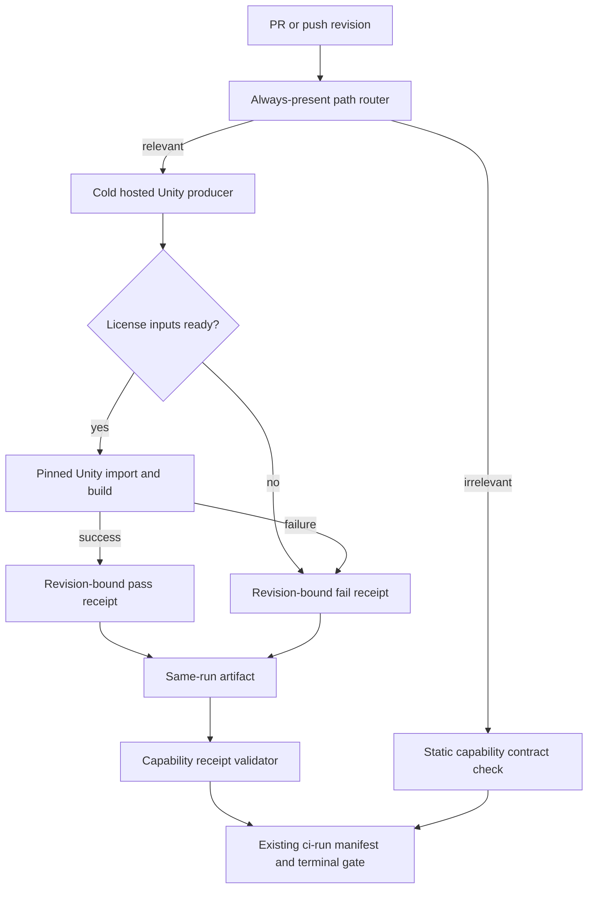
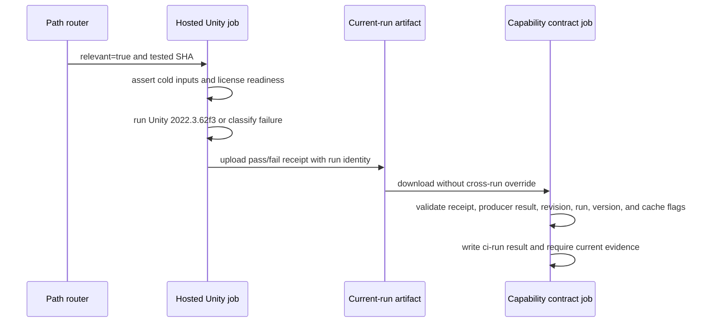

# Hosted Unity C# Compile Evidence - Plan

## Goal Capsule

- **Objective:** Establish revision-bound, machine-verifiable evidence that the Unity 2022.3 C# project compiles on a GitHub-hosted runner, and make that evidence a fail-closed input to the flagship capability gate.
- **Authority:** GitHub Issue #2 and the repository capability contract define acceptance; `unity-prototype/ProjectSettings/ProjectVersion.txt` defines the exact Unity editor line.
- **Execution profile:** Code change with hosted CI, local contract validation, failure injection, pull-request delivery, and an external licensing dependency.
- **Stop condition:** Keep Issue #2 open and preserve the pull request when hosted licensing cannot be obtained or the real Unity compile has not passed.
- **Tail ownership:** The implementation owns the workflow, hosted receipt, capability binding, tests, documentation, pull request, and observed hosted check outcome; it does not own external Unity license provisioning.

---

## Product Contract

### Summary

For every revision that changes Unity/C# or the capability certification surface, GitHub Actions will either produce a fresh Hosted Unity 2022.3 compile result tied to that revision or fail the capability gate with an explicit, machine-readable reason. Irrelevant revisions may bypass the expensive Unity job without claiming hosted compile success.

### Problem Frame

The current C# smoke command is a useful local Roslyn diagnostic, but it is not proof that Unity imported and compiled the project on hosted infrastructure. A reusable local DLL, cached Unity `Library`, stale build, or receipt from another commit could otherwise be mistaken for certification. Unity activation is also an external dependency: missing or invalid credentials must be visible as a failed hosted attempt, never converted into a successful capability claim.

### Actors

- A1. A contributor changes Unity/C# or capability-certification files and opens or updates a pull request.
- A2. A maintainer reviews a single terminal capability check and its attached evidence.
- A3. A GitHub-hosted runner performs the clean Unity compile and identifies its workflow run, attempt, and tested revision.
- A4. The product capability verifier consumes only evidence produced for its current GitHub Actions run and revision.

### Requirements

**Triggering and isolation**

- R1. Pull-request and push evaluation must classify changes path-aware: Unity C# and project inputs, the hosted workflow, the compile-smoke tool, and capability contract/runner/test inputs require hosted Unity certification.
- R2. An irrelevant revision may skip the expensive hosted Unity job, but its terminal check must make no hosted compile claim and must still validate the static capability contract.
- R3. The hosted compile must use exactly Unity `2022.3.62f3`, matching the committed project version, and must test the revision GitHub identifies as the workflow's tested revision.
- R4. Hosted certification must start from a fresh checkout and must not restore or consume a cached Unity `Library`, prior build output, prior compile artifact, or local result.

**Licensing and authoritative execution**

- R5. The hosted path must explicitly distinguish license-input availability from a successful Builder result. Missing or inaccessible credentials must yield `licensing-unavailable`; once credentials are present, a failed Builder must use the honest combined `unity-activation-or-execution-failed` classification because the action does not prove which phase failed. Both are non-pass receipts with a failed terminal gate, and untrusted pull-request contexts must not gain secrets through a privileged trigger.
- R6. A real Unity editor invocation on a GitHub-hosted runner is the authoritative compile. The existing local Roslyn compilation may remain as a developer diagnostic, but it cannot certify hosted evidence.

**Evidence integrity**

- R7. Every relevant hosted attempt must, when the runner can finalize, emit a machine-readable pass/fail receipt containing at least the tested revision, source revision where distinct, workflow run ID and attempt, hosted runner identity, exact Unity version, license readiness, clean-input/cache assertions, status, and failure classification.
- R8. The capability verifier must accept only a passing, well-formed receipt from the current workflow run and attempt whose tested revision matches the current GitHub revision. A missing, malformed, stale, mismatched, or non-pass receipt must fail closed.
- R9. The existing capability contract must name hosted Unity C# compilation as required automated evidence. The capability runner must invoke its validator in hosted-required mode, and a compile or validation failure must make the capability gate fail.
- R10. Failure paths must preserve the receipt and relevant Unity diagnostics as hosted artifacts when finalization is possible, while the terminal check still returns failure.

**Product and release truthfulness**

- R11. Capability engineering maturity and distribution declarations must remain unchanged. This work does not promote the product to stable or distributable.
- R12. Documentation must distinguish local diagnostic results from hosted certification, record the observed GitHub Actions run, and state any licensing or secrets blocker accurately.
- R13. Issue #2 may be closed only after a real hosted Unity compile for the pull-request revision passes and its revision-bound receipt is consumed successfully by the capability gate.

### Key Flows

- F1. Irrelevant change
  - **Trigger:** A revision changes no hosted-certification path.
  - **Actors:** A1, A2, A4
  - **Steps:** Change classification returns irrelevant; the Unity job is skipped; the terminal job validates the static contract without synthesizing hosted evidence.
  - **Outcome:** CI can pass without spending a Unity license and without asserting that Unity compiled this revision.
  - **Covered by:** R1, R2, R9
- F2. Relevant licensed change
  - **Trigger:** A revision changes a hosted-certification path and valid license inputs are available.
  - **Actors:** A1, A2, A3, A4
  - **Steps:** A clean hosted runner invokes the pinned Unity editor; finalization emits and uploads a passing receipt; the capability runner validates the same-run receipt and completes its gate.
  - **Outcome:** The pull-request revision has reviewable, revision-bound Hosted Unity compile evidence.
  - **Covered by:** R1, R3, R4, R6-R10
- F3. License unavailable or invalid
  - **Trigger:** A relevant hosted run cannot access or activate a Unity license.
  - **Actors:** A2, A3, A4
  - **Steps:** The compile does not receive a passing outcome; finalization records a licensing failure where possible; the evidence validator rejects the receipt; the terminal gate fails.
  - **Outcome:** The pull request and Issue #2 remain open with an external blocker instead of a false success.
  - **Covered by:** R5, R7-R10, R12, R13
- F4. Compile or evidence-integrity failure
  - **Trigger:** Unity compilation fails, the receipt is absent or malformed, or its run/revision identity does not match.
  - **Actors:** A2, A3, A4
  - **Steps:** Diagnostics and a failure receipt are uploaded when possible; the capability validator rejects the evidence; the terminal check fails.
  - **Outcome:** No stale or locally produced result can certify the revision.
  - **Covered by:** R4, R6-R10

### Acceptance Examples

- AE1. **Covers R1-R4.** Given a pull request changes a Unity C# file, when CI evaluates it, then it runs Unity `2022.3.62f3` from a fresh checkout without a restored `Library` or prior build.
- AE2. **Covers R2.** Given a pull request changes only an unrelated document, when CI evaluates it, then the terminal capability check can pass while the hosted Unity job is skipped and no passing hosted receipt is fabricated.
- AE3. **Covers R5, R7-R10.** Given Unity credentials are unavailable, when a relevant hosted run executes, then its observable result is a licensing-classified non-pass and the terminal capability gate fails.
- AE4. **Covers R6-R9.** Given local Roslyn compilation succeeds but the hosted Unity editor reports a compiler error, when the capability gate runs, then the gate fails.
- AE5. **Covers R7-R9.** Given a passing receipt belongs to another commit, workflow run, or attempt, when the current capability gate consumes it, then validation fails.
- AE6. **Covers R10-R13.** Given a real hosted run completes, when maintainers review the pull request, then they can inspect the machine receipt and diagnostics; Issue #2 remains open unless the real Unity compile and gate both passed.

### Key Decisions

- **Always-present path permit:** Keep a terminal workflow check present for all target-branch revisions and place path awareness inside it, avoiding a skipped required workflow that can remain pending while still sparing irrelevant revisions the Unity job.
- **Cold certification chamber:** Authoritative evidence comes from a clean hosted Unity invocation with no Unity cache restoration or old build reuse.
- **Same-run evidence airlock:** Separate evidence production from capability consumption and require exact run, attempt, revision, and Unity-version matches at the boundary.
- **Dual-purpose smoke tool:** Preserve local Roslyn diagnostics for developers while adding a distinct fail-closed hosted receipt path that cannot silently fall back to local compilation.
- **Failure receipts are evidence, not success:** Upload structured failure information whenever possible, but never let artifact publication or `continue-on-error` convert a failed compile into a passing terminal gate.

### Scope Boundaries

- In scope: `.github/workflows/**`, `tools/unity_csharp_compile_smoke.ps1`, narrowly necessary capability runner/config/tests, related packaging/capability documentation, and a dated hosted-verification record.
- Frozen: game rules, AI behavior, Unity UI, Unity viewmodel/action bridge contracts, role content, and capability maturity/distribution declarations.
- Not certification: local Roslyn success, cached Unity imports, old builds, previous workflow artifacts, or a receipt not bound to the current run and revision.
- Not owned here: purchasing or provisioning a Unity license, changing branch-protection policy, promoting release maturity, or closing Issue #2 before the hosted pass condition is met.

### Dependencies and Open Conditions

- A valid Unity license mechanism supported by the hosted runner must be available to the repository's trusted workflow context for the real compile to pass.
- GitHub-hosted pull requests from forks and automated actors may not receive protected environment secrets; those cases must fail or remain visibly uncertified rather than using a privileged event.
- The real hosted run outcome is intentionally unresolved until the branch is pushed and GitHub Actions executes. A licensing failure is an external blocker, not grounds to weaken the gate.

---

## Planning Contract

Product Contract unchanged.

### Key Technical Decisions

- KTD1. **Keep the required check present and route internally.** The workflow continues to trigger for every pull request and push to `dev`/`main`; a first job computes a conservative diff and decides whether hosted Unity is required. This avoids the permanently pending required-check behavior GitHub documents for top-level path filters.
- KTD2. **Compile the tested merge revision, record the source revision separately.** On pull requests, checkout, the receipt, and the capability results manifest all bind to `GITHUB_SHA`, which GitHub defines as the pull-request merge commit. `github.event.pull_request.head.sha` is retained as `sourceRevision` for traceability, never substituted for the tested revision.
- KTD3. **Use one cold GameCI Unity Builder invocation.** Commit-pinned GameCI Unity Builder v4 runs exact Unity `2022.3.62f3` against `unity-prototype` on `ubuntu-latest` with `StandaloneLinux64` and its normal activation lifecycle. A successful action with `engineExitCode=0` proves activation, import, C# compilation, and build success; its build output is disposable and is not used as evidence. If the Builder fails after credentials are ready, the receipt records both activation and Unity outcomes as `unknown` with `unity-activation-or-execution-failed` instead of inventing a phase-specific diagnosis. Every third-party and official action in the credential-bearing workflow is pinned to a reviewed full commit SHA with its release version recorded in a comment.
- KTD4. **Separate producer truth from consumer certification.** The hosted job writes and uploads a receipt even after a controlled Unity failure. The existing Windows capability job downloads that same-run artifact and invokes the existing `ci-run` evidence command; both the receipt and the upstream producer result must pass.
- KTD5. **Reuse the capability contract's `ci-run` semantics.** No new freshness policy is introduced. The capability runner adds the existing `test:unity-csharp-smoke` script to its exact allowlist, forces it into hosted-validation mode, and records the validator exit code in the existing revision-and-contract-hash-bound results manifest.
- KTD6. **Preserve local Roslyn as diagnostics only.** Direct local use of `tools/unity_csharp_compile_smoke.ps1` retains its current compiler behavior. Hosted-required mode validates the receipt and cannot fall back to local Unity discovery, Roslyn, a DLL, or any build directory.
- KTD7. **Treat license input as a protected prerequisite, not a success signal.** A personal run is input-ready when `UNITY_LICENSE` is present; a professional run requires `UNITY_SERIAL`, `UNITY_EMAIL`, and `UNITY_PASSWORD`. All Unity credentials must exist only as environment secrets for `hosted-unity-compile`, behind required trusted reviewers with self-review disabled. The YAML selects that environment but cannot configure its protection; external repository configuration remains a blocker until maintainers establish and verify those settings. Fork, Dependabot, missing-secret, and invalid-license paths remain non-pass, and the workflow does not use `pull_request_target`.
- KTD8. **Fail safe on routing and provenance uncertainty.** Missing diff bases, zero SHAs, diff errors, absent artifacts, malformed receipts, upstream cancellation, or any identity mismatch require hosted execution or fail the terminal gate. False positives cost hosted minutes; false negatives create invalid certification.

### Assumptions

- The terminal check name `capability-contract` is retained because branch protection may depend on it.
- A same-repository trusted workflow will eventually receive either a personal license file or a professional serial plus account credentials through the protected `hosted-unity-compile` environment. No repository-level Actions secrets were visible at planning time, and the required environment protection/secret configuration is external and not yet proven.
- The hosted build may be slower and stricter than the requested compile proof; this is acceptable because it provides stronger Unity compilation evidence without changing gameplay or release claims.
- The repository does not currently use a merge queue. If `merge_group` becomes active, its event must be added to the router before the check is required there.

### High-Level Technical Design

### Evidence Boundary

The hosted receipt has a versioned schema and carries `status`, `testedRevision`, `sourceRevision`, repository/workflow identity, run ID and attempt, runner environment, exact Unity version and project revision, license readiness/mode, activation outcome, Unity action outcome, clean-input and cache assertions, failure classification, and generation time. A pass is valid only for `github-hosted`, `2022.3.62f3`, the current repository/workflow/run/attempt/SHA, clean inputs, no Unity cache, ready license inputs, successful activation and Unity outcomes, and `engineExitCode=0`. Missing inputs produce `licensing-unavailable` with both outcomes `not-run`. A Builder failure after inputs are ready produces `unity-activation-or-execution-failed` with both outcomes `unknown`, deliberately refusing to guess whether activation, import, compilation, or a later build stage failed.

### Path Routing Contract

The router evaluates both old and new paths by disabling rename detection. Both Git diffs use `--name-only -z`, and Bash consumes each pathname with `read -r -d ''`; this raw NUL transport preserves Git pathnames containing embedded newlines or non-ASCII bytes. It covers `.github/workflows/**`, `tools/unity_csharp_compile_smoke.ps1`, Unity compile inputs under `unity-prototype/Assets/**` limited to C# sources, assembly definitions/references, compiler response files, managed DLLs, and their metadata, all package and project settings under `unity-prototype/Packages/**` and `unity-prototype/ProjectSettings/**`, `config/product_capabilities.json`, the capability contract and runner, their focused tests, `package.json`, and generated capability documentation. The dated hosted-verification record is observational only and does not independently require certification. Pull requests compare the full base-to-head diff while testing the checkout merge SHA; therefore any follow-up commit on this PR still reruns hosted Unity because the PR continues to contain relevant changes. Pushes compare `before` to `sha`. An unusable comparison defaults to `hosted-required=true`.

### Risks and Dependencies

| Risk or dependency | Consequence | Mitigation |
|---|---|---|
| Unity license secrets are absent | The real hosted producer cannot pass | Emit `licensing-unavailable`, fail the gate, preserve PR and Issue #2, and document the external blocker |
| Protected environment is absent or misconfigured | Credentials could be unavailable or exposed without the intended review boundary | Keep all credentials out of repository secrets, require trusted reviewers with self-review disabled on `hosted-unity-compile`, and treat repository configuration as an external blocker |
| Fork or Dependabot cannot receive secrets | Relevant untrusted changes remain uncertified | Use the unprivileged `pull_request` event and fail visibly; never run untrusted code under `pull_request_target` |
| Unity Builder fails after credentials are present | Activation, import, compile, or build may be responsible | Record `unity-activation-or-execution-failed`, set both phase outcomes to `unknown`, preserve any engine exit code and sanitized logs, and do not invent a phase-specific diagnosis |
| Router misses a path or diff | A revision could avoid certification | Use conservative directory coverage, no-rename diff output, and fail-safe hosted routing on errors |
| Upstream job is skipped, cancelled, or cannot upload | Consumer has no trustworthy evidence | Terminal job uses `if: always()`, treats missing artifact as failure, and also checks `needs` result |
| A stale/local receipt is supplied | False hosted certification | Validate current repository, workflow, run ID/attempt, tested SHA, version, runner environment, clean/cache flags, and status |
| Cold Unity import exceeds current CI time | Hosted job times out | Give the producer its own bounded timeout and retain a short receipt validator in the capability runner |

### Sources and Research

- Repository precedent: commits `71d6001` and `53d6e0e` established the capability contract and bound flagship replay evidence with an exact allowlist, failure injection, and generated docs.
- `unity-prototype/ProjectSettings/ProjectVersion.txt` pins Unity `2022.3.62f3` revision `96770f904ca7`.
- [GitHub workflow syntax](https://docs.github.com/en/actions/reference/workflows-and-actions/workflow-syntax) documents `needs`, `always()`, and the pending behavior of path-filtered workflows.
- [GitHub pull-request event semantics](https://docs.github.com/en/actions/reference/workflows-and-actions/events-that-trigger-workflows) defines `GITHUB_SHA` as the pull-request merge commit and documents fork secret restrictions.
- [GitHub workflow artifacts](https://docs.github.com/en/actions/concepts/workflows-and-actions/workflow-artifacts) defines current-run cross-job artifact transfer.
- [GameCI Unity Builder v4](https://game.ci/docs/github/builder/) documents `projectPath`, `unityVersion`, `targetPlatform`, license inputs, build output, and `engineExitCode`.
- [Unity 2022.3 license management](https://docs.unity3d.com/2022.3/Documentation/Manual/ManagingYourUnityLicense.html) is the authoritative license lifecycle reference.

---

## Implementation Units

### U1. Define the hosted receipt writer and validator

- **Goal:** Extend the existing C# smoke tool with a strict hosted receipt contract while preserving its current local Roslyn diagnostic mode.
- **Requirements:** R3-R8, R10; F2-F4; AE3-AE5
- **Dependencies:** None
- **Files:** `tools/unity_csharp_compile_smoke.ps1`, `tests/product_capability_ci_runner.mjs`
- **Approach:** Add explicit hosted write and validation paths. Writer input comes from GitHub-owned environment identity plus controlled workflow outcomes; validator compares every load-bearing field with the current environment and rejects pass receipts that do not prove a hosted, exact-version, clean, same-run Unity success. Hosted-required selection must bypass all local compiler discovery and output handling.
- **Execution note:** Begin with failing receipt tests and failure-injection fixtures before changing the PowerShell behavior.
- **Patterns to follow:** Preserve the script's current terminating-error posture and explicit exit codes. Mirror the runner test's temporary-fixture and child-process assertions.
- **Test scenarios:**
  - A direct invocation without hosted-required mode still follows the existing local diagnostic path.
  - Covers AE5. A valid pass receipt for the current SHA/run/attempt/repository/workflow/version validates successfully.
  - Missing file, malformed JSON, unsupported schema/version, and `status: fail` each exit nonzero.
  - Covers AE5. Wrong SHA, source identity, run ID, run attempt, repository, workflow, runner environment, Unity version, or project revision each exits nonzero.
  - A receipt claiming dirty inputs, Unity cache use, absent license readiness, skipped Unity, or a non-success Unity outcome cannot validate as pass.
  - Covers AE4. Hosted-required mode cannot accept a locally emitted DLL or fall through to Roslyn when the receipt is invalid.
- **Verification:** The focused Node contract suite drives PowerShell through valid and adversarial receipts, and the unchanged direct smoke command remains locally usable.

### U2. Bind hosted validation into the capability contract

- **Goal:** Make hosted Unity receipt validation required automated evidence for the flagship track and fail the existing capability gate when it fails.
- **Requirements:** R8, R9, R11, R12; F1-F4; AE2-AE5
- **Dependencies:** U1
- **Files:** `scripts/run_product_capability_ci.mjs`, `config/product_capabilities.json`, `tests/product_capability_ci_runner.mjs`, `tests/product_capability_contracts.mjs`, `README.md`, `docs/CAPABILITY_STATUS.md`
- **Approach:** Add `test:unity-csharp-smoke` to the reviewed exact-definition allowlist. When this evidence is collected, overlay hosted-required mode and the workflow-provided receipt path for that script only. Add a bounded automated-contracts evidence entry and regenerate capability docs; retain existing `ci-run` manifest revision/contract-hash binding and `check --require-current` behavior.
- **Execution note:** Use the prior flagship replay evidence commit as the test-first pattern; prove the injected failure before accepting the pass path.
- **Patterns to follow:** `REVIEWED_SCRIPT_DEFINITIONS`, `collectCiRunCommands`, `evaluateCiRunEvidence`, generated capability documentation, and existing maturity/distribution immutability assertions.
- **Test scenarios:**
  - The new command appears once in deterministic contract order and its package script body must exactly match the reviewed definition.
  - Only the Unity evidence command receives hosted-required environment; other evidence commands retain their existing environment.
  - Covers AE4. Injecting a nonzero Unity validator result still runs later evidence, writes the failure in the manifest, and fails the automated gate.
  - A missing hosted receipt produces a failed current-revision capability result instead of falling back locally.
  - Wrong outer manifest revision or contract hash remains rejected by the existing contract.
  - Covers AE2. Static `capabilities:check` remains valid without ephemeral hosted results for an irrelevant-path workflow.
  - Engineering maturity, default selection, distribution status, and distribution blocker remain byte-for-byte/semantically unchanged after the new evidence and after failure injection.
- **Verification:** Focused capability tests pass, generated files are current, and a deliberately failed hosted validator makes `capabilities:verify` nonzero.

### U3. Build the path-aware Hosted Unity producer and terminal gate

- **Goal:** Convert the existing CI workflow into an always-present router, cold hosted Unity producer, and same-run capability consumer.
- **Requirements:** R1-R10; F1-F4; AE1-AE5
- **Dependencies:** U1, U2
- **Files:** `.github/workflows/ci.yml`, `tests/product_capability_ci_runner.mjs`
- **Approach:** Add a full-history path router with event-aware SHA comparison, raw NUL-delimited pathname transport, and conservative fail-safe output. For relevant changes, run commit-pinned GameCI Builder v4 directly after protected license-input readiness succeeds. The clean hosted Linux job is pinned to Unity `2022.3.62f3`, with no Unity/build/evidence cache. Finalize and upload a pass/fail receipt under `if: always()` with short retention; exclude license files, environment dumps, activation payloads, and build directories. Preserve the `capability-contract` Windows terminal job under `if: always()`; irrelevant changes run static contract validation, relevant changes download the current-run receipt and run full capability verification, then independently reject a non-success producer result.
- **Execution note:** Treat workflow/config as integration work: add static contract assertions first, then rely on the real pushed run for authoritative syntax and action behavior.
- **Patterns to follow:** Existing checkout/setup-node/npm/as-of steps and the repository's single terminal capability check; GameCI's documented v4 builder inputs and official artifact actions.
- **Test scenarios:**
  - Covers AE1. A Unity C# or project/capability path selects hosted-required; an unrelated path selects static-only.
  - Rename/delete classification observes old and new paths; an invalid base or diff failure selects hosted-required.
  - The workflow contains exact Unity `2022.3.62f3`, `projectPath: unity-prototype`, and no Unity `Library`, old build, or receipt cache restore.
  - Covers AE3. Missing credential inputs skip Unity Builder and produce `licensing-unavailable`; that receipt fails the producer and terminal gate.
  - Covers AE4. A Builder failure after credentials are ready still reaches finalization/upload as `unity-activation-or-execution-failed`, with activation and Unity outcomes both `unknown`, and cannot be hidden by `continue-on-error`.
  - Covers AE5. Artifact absence or a receipt from another run/attempt/revision fails the terminal job.
  - Covers AE2. Irrelevant changes leave the expensive producer skipped while the stable terminal check succeeds without a hosted claim.
- **Verification:** Local workflow-contract tests and YAML parsing pass; GitHub accepts and runs the pushed workflow; the Actions job graph and artifacts exhibit the designed relevant-path failure/success behavior.

### U4. Record hosted outcome and deliver the pull request

- **Goal:** Publish reproducible verification evidence without overstating capability or closing Issue #2 prematurely.
- **Requirements:** R10-R13; F2-F4; AE6
- **Dependencies:** U3
- **Files:** `docs/verification/HOSTED_UNITY_CSHARP_2026-07-20.md`
- **Approach:** Commit an initial verification record with local syntax checks, capability contracts, receipt failure injection, the closure policy, and pending hosted fields; then open the pull request against `dev` using `Related to #2` without an auto-closing keyword. After the first hosted run, update the record once with that run's URL/ID/attempt, tested/source SHAs, receipt status, license state, and limitations. Because the full PR diff remains relevant, this documentation commit intentionally starts a second hosted run for the final PR revision. Treat that second run as the closure/delivery authority and report it through the immutable artifact, PR check, and final response without another self-invalidating documentation commit.
- **Execution note:** The first real run is an experiment against external license state. Preserve the red PR and open Issue when credentials are absent instead of weakening or bypassing the gate.
- **Patterns to follow:** `docs/verification/FLAGSHIP_CAPABILITY_CONTRACT_2026-07-13.md` for provenance, command/result tables, and non-certification language.
- **Test scenarios:**
  - The committed record explains how to locate and validate the first observed workflow run; the second immutable receipt, PR check, and delivery report bind the final documented PR revision and are not copied into another commit.
  - Covers AE6. A licensing failure is recorded as an external blocker and neither the document nor PR claims hosted compile completion.
  - A real passing hosted receipt plus a successful consumer gate is required before Issue #2 is closed.
  - The final diff remains inside the exclusive scope and contains no maturity/distribution change or frozen gameplay/AI/UI/bridge change.
- **Verification:** PR targets `dev`, hosted check reaches a terminal state, Issue #2 state matches the closure rule, and the verification record matches GitHub's authoritative run data.

---

## Verification Contract

| Gate | Command or evidence | Applies to | Pass signal |
|---|---|---|---|
| Workflow syntax | `rtk gh workflow view ci.yml --yaml` after push, plus local YAML/static workflow-contract parsing | U3 | GitHub recognizes the workflow and local parser/contracts return zero |
| Focused capability contracts | `rtk npm run test:product-capabilities` | U1-U3 | All schema, allowlist, environment, immutability, workflow, and failure-path assertions pass |
| Hosted receipt adversarial suite | Focused cases inside `rtk node tests/product_capability_ci_runner.mjs` | U1-U3 | Valid same-run receipt passes; every missing/malformed/stale/mismatched/fail case exits nonzero |
| Local C# diagnostic compatibility | `rtk npm run test:unity-csharp-smoke` | U1 | Existing local Roslyn diagnostic still returns zero and is not labeled hosted evidence |
| Failure injection | Focused runner fixture forces `test:unity-csharp-smoke` nonzero | U2 | Results manifest records failure, capability gate returns nonzero, later evidence still executes, maturity/distribution remain unchanged |
| Generated capability docs | `rtk npm run capabilities:write` followed by `rtk npm run capabilities:check` | U2 | `README.md` and `docs/CAPABILITY_STATUS.md` are current with bounded hosted evidence wording |
| Relevant repository suite | `rtk npm test` | U1-U3 | Full JS/Electron/Unity contract suite returns zero, or any unrelated pre-existing failure is isolated and documented |
| Hosted Actions run | `rtk gh pr checks <PR> --watch` and `rtk gh run view <RUN>` | U3-U4 | Workflow reaches a terminal state and exposes the expected producer receipt plus terminal capability result |
| Issue closure guard | `rtk gh issue view 2 --json state` | U4 | Issue remains OPEN unless current PR revision has a real hosted pass consumed by the green capability gate |
| Scope audit | `rtk git diff --name-only origin/dev...HEAD` and targeted declaration comparison | All | Only allowed files changed; frozen surfaces and maturity/distribution declarations are unchanged |

---

## Definition of Done

- U1 is done when hosted receipt write/validation is strict, adversarially tested, and incapable of local fallback while local Roslyn diagnostics still work.
- U2 is done when the flagship automated capability gate declares and executes hosted Unity evidence through the existing revision-bound `ci-run` manifest, including a proven nonzero failure path, without changing maturity or distribution truth.
- U3 is done when GitHub accepts an always-present path-aware workflow that cold-builds exact Unity `2022.3.62f3`, handles licensing explicitly, transfers a current-run pass/fail receipt, and leaves no producer skip/failure path capable of passing the terminal gate when the router selected `hosted-required=true`.
- U4 is done when local validation results and the actual Actions run are recorded, the branch is committed and pushed, and a PR against `dev` is open with Issue #2 linked but not prematurely auto-closed.
- Issue #2 is closed only if GitHub's real hosted Unity producer passes for the PR's tested revision and the same run's terminal capability gate consumes that receipt successfully.
- If license secrets are absent or invalid, the deliverable stops with a truthful external-blocker record, a preserved PR, and an open Issue #2; no success, stable, distributable, or release claim is made.
- The final diff contains no abandoned experimental code, cached `Library`, build output, local receipt, generated model/data output, or changes outside the exclusive scope.
